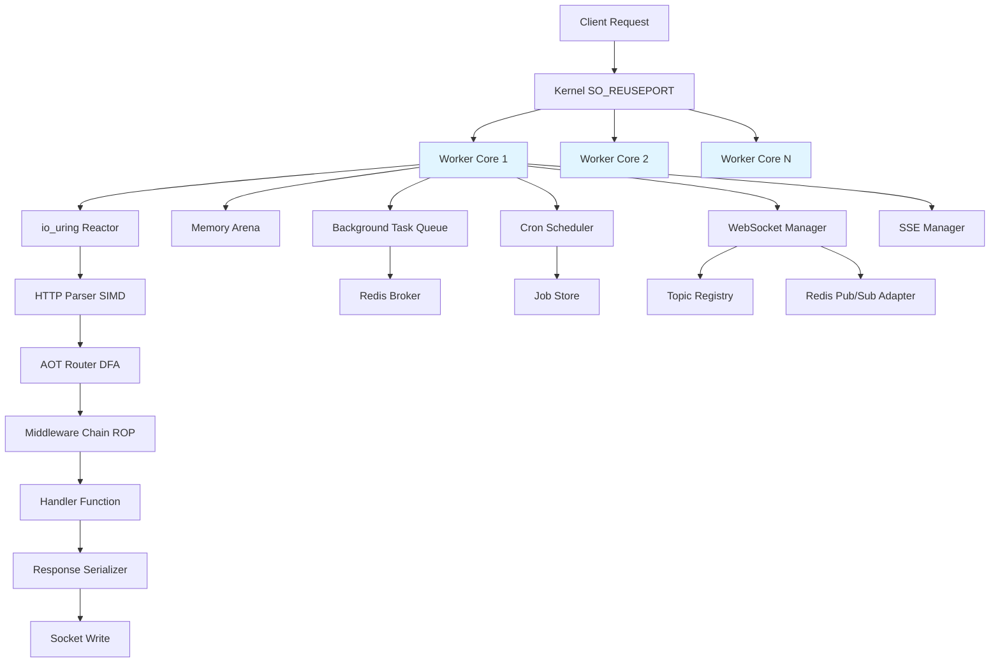
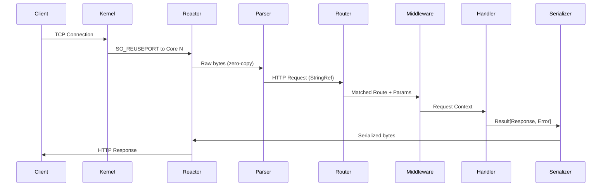

# Design Document: Sweet API Framework

## Overview

Sweet is a high-performance API server framework written in Mojo that combines the developer experience of FastAPI, the architectural principles of Fastify, and the AOT compilation approach of ElysiaJS. The framework achieves extreme performance through MLIR-based AOT compilation, Railway Oriented Programming for error handling, thread-per-core shared-nothing architecture, io_uring/epoll reactor for async I/O, zero-copy HTTP parsing with SIMD, and compile-time routing and validation.

The framework targets sub-millisecond latency for typical API operations while maintaining type safety and excellent developer ergonomics. By leveraging Mojo's compile-time capabilities and MLIR backend, Sweet eliminates runtime overhead traditionally associated with dynamic routing, validation, and serialization. The shared-nothing architecture ensures predictable performance under load by avoiding cross-core synchronization and cache coherency issues.

## Architecture



### Thread-Per-Core Architecture


Each worker core operates independently with its own:
- io_uring/epoll reactor instance
- Memory arena for request allocation
- Background task SPSC queue (multi-core) or local deque (single-core)
- Cron scheduler with min-heap
- HTTP client connection pool

The kernel distributes incoming connections across cores using SO_REUSEPORT, eliminating the need for application-level load balancing or work stealing in V1.

### Request Lifecycle Flow



## Components and Interfaces

### Component 1: Network Reactor

**Purpose**: Manages async I/O operations using io_uring (Linux) or epoll (fallback) for socket events

**Interface**:
```mojo
@value
struct ReactorConfig:
    var io_uring_entries: Int
    var tcp_nodelay: Bool
    var tcp_quickack: Bool
    var so_reuseport: Bool
    var backlog: Int

trait Reactor:
    fn run(inout self) raises -> None
    fn register_socket(inout self, fd: Int, handler: SocketHandler) raises -> None
    fn unregister_socket(inout self, fd: Int) raises -> None
    fn submit_read(inout self, fd: Int, buffer: DTypePointer[DType.uint8], size: Int) raises -> None
    fn submit_write(inout self, fd: Int, data: DTypePointer[DType.uint8], size: Int) raises -> None
    fn stop(inout self) raises -> None

struct IoUringReactor(Reactor):
    var ring: IoUring
    var config: ReactorConfig
    var handlers: Dict[Int, SocketHandler]
    var running: Bool
    
    fn __init__(inout self, config: ReactorConfig) raises
    fn run(inout self) raises -> None
    fn register_socket(inout self, fd: Int, handler: SocketHandler) raises -> None
```

**Responsibilities**:
- Accept incoming TCP connections
- Submit async read/write operations to io_uring
- Poll for completion events
- Dispatch events to registered handlers
- Configure socket options (TCP_NODELAY, TCP_QUICKACK)


### Component 2: HTTP Parser

**Purpose**: Zero-copy HTTP/1.1 parsing using SIMD instructions and StringRef for header/body access

**Interface**:
```mojo
@value
struct HttpMethod:
    var value: String
    
    alias GET = HttpMethod("GET")
    alias POST = HttpMethod("POST")
    alias PUT = HttpMethod("PUT")
    alias DELETE = HttpMethod("DELETE")
    alias PATCH = HttpMethod("PATCH")

@value
struct HttpRequest:
    var method: HttpMethod
    var path: StringRef  # Zero-copy reference to buffer
    var headers: Dict[StringRef, StringRef]
    var body: StringRef
    var query_params: Dict[StringRef, StringRef]
    var version: (Int, Int)  # (1, 1) for HTTP/1.1

@value
struct HttpResponse:
    var status: Int
    var headers: Dict[String, String]
    var body: String
    
    fn __init__(inout self, status: Int = 200):
        self.status = status
        self.headers = Dict[String, String]()
        self.body = ""

trait HttpParser:
    fn parse(inout self, buffer: DTypePointer[DType.uint8], size: Int) raises -> Result[HttpRequest, ParseError]

struct SimdHttpParser(HttpParser):
    var buffer_ref: DTypePointer[DType.uint8]
    var buffer_size: Int
    
    fn parse(inout self, buffer: DTypePointer[DType.uint8], size: Int) raises -> Result[HttpRequest, ParseError]
    fn parse_request_line(self, start: Int, end: Int) raises -> Result[(HttpMethod, StringRef, (Int, Int)), ParseError]
    fn parse_headers(self, start: Int, end: Int) raises -> Result[Dict[StringRef, StringRef], ParseError]
    fn find_crlf_simd(self, start: Int) -> Int  # SIMD search for \r\n
```

**Responsibilities**:
- Parse HTTP/1.1 request line (method, path, version)
- Parse headers using SIMD for CRLF detection
- Extract query parameters from path
- Maintain zero-copy StringRef to original buffer
- Validate HTTP protocol compliance


### Component 3: AOT Router

**Purpose**: Compile-time route compilation into radix trie or DFA for O(1) or O(log n) route matching

**Interface**:
```mojo
@value
struct RouteParams:
    var params: Dict[String, String]
    
    fn get(self, key: String) -> Optional[String]:
        return self.params.get(key)

@value
struct Route:
    var pattern: String
    var method: HttpMethod
    var handler: fn(HttpRequest, RouteParams) raises -> Result[HttpResponse, Error]
    var param_names: List[String]

trait Router:
    fn match_route(self, method: HttpMethod, path: StringRef) -> Result[RouteMatch, RouteError]
    fn add_route(inout self, route: Route) raises -> None

@value
struct RouteMatch:
    var handler: fn(HttpRequest, RouteParams) raises -> Result[HttpResponse, Error]
    var params: RouteParams

struct RadixRouter(Router):
    var root: RadixNode
    var routes_by_method: Dict[String, RadixNode]
    
    fn match_route(self, method: HttpMethod, path: StringRef) -> Result[RouteMatch, RouteError]
    fn add_route(inout self, route: Route) raises -> None
    fn compile_routes(inout self) raises -> None  # AOT compilation step

@value
struct RadixNode:
    var prefix: String
    var children: List[RadixNode]
    var handler: Optional[fn(HttpRequest, RouteParams) raises -> Result[HttpResponse, Error]]
    var param_name: Optional[String]
    var is_wildcard: Bool
```

**Responsibilities**:
- Compile route patterns into radix trie at build time
- Match incoming paths to handlers in O(path_length)
- Extract path parameters (e.g., /users/:id)
- Support wildcard routes (e.g., /static/*)
- Generate compile-time route validation errors


### Component 4: Validation System

**Purpose**: Compile-time schema validation with Pydantic-like DX and zero runtime cost

**Interface**:
```mojo
trait Validator[T]:
    fn validate(self, value: T) raises -> Result[T, ValidationError]

@value
struct Schema[T]:
    var validators: List[Validator[T]]
    
    fn validate(self, value: T) raises -> Result[T, ValidationError]:
        var result = value
        for validator in self.validators:
            result = validator[].validate(result)?
        return Ok(result)

# Compile-time schema definition
@register_passable("trivial")
struct StringValidator(Validator[String]):
    var min_length: Int
    var max_length: Int
    var pattern: Optional[String]
    
    fn validate(self, value: String) raises -> Result[String, ValidationError]:
        if len(value) < self.min_length:
            return Err(ValidationError("String too short"))
        if len(value) > self.max_length:
            return Err(ValidationError("String too long"))
        return Ok(value)

@register_passable("trivial")
struct IntValidator(Validator[Int]):
    var min_value: Int
    var max_value: Int
    
    fn validate(self, value: Int) raises -> Result[Int, ValidationError]:
        if value < self.min_value or value > self.max_value:
            return Err(ValidationError("Integer out of range"))
        return Ok(value)

# Macro for compile-time schema generation
@parameter
fn validate_request[T: AnyType](request: HttpRequest) raises -> Result[T, ValidationError]:
    # Compile-time code generation for validation
    # Similar to Pydantic's model validation
    pass
```

**Responsibilities**:
- Define validation schemas at compile time
- Generate validation code during compilation
- Provide zero-cost abstractions for type checking
- Support nested object validation
- Generate descriptive error messages


### Component 5: JSON Serializer

**Purpose**: SIMD-accelerated JSON parsing and serialization with zero-copy where possible

**Interface**:
```mojo
trait JsonSerializable:
    fn to_json(self) raises -> String
    fn from_json(json: String) raises -> Self

struct JsonSerializer:
    fn serialize[T: JsonSerializable](value: T) raises -> String
    fn deserialize[T: JsonSerializable](json: String) raises -> Result[T, JsonError]
    fn serialize_simd(value: Dict[String, Any]) raises -> String
    fn parse_simd(json: StringRef) raises -> Result[Dict[String, Any], JsonError]

# SIMD-optimized JSON parsing primitives
fn find_json_delimiters_simd(buffer: DTypePointer[DType.uint8], size: Int) -> List[Int]:
    # Use SIMD to find: { } [ ] " : ,
    pass

fn parse_string_simd(buffer: StringRef) raises -> Result[String, JsonError]:
    # SIMD-accelerated string parsing with escape handling
    pass

fn parse_number_simd(buffer: StringRef) raises -> Result[Float64, JsonError]:
    # SIMD-accelerated number parsing
    pass
```

**Responsibilities**:
- Serialize Mojo structs to JSON strings
- Deserialize JSON to Mojo structs
- Use SIMD for delimiter detection and parsing
- Handle escape sequences efficiently
- Support streaming for large payloads

### Component 6: Middleware System

**Purpose**: Railway Oriented Programming middleware chain with lifecycle hooks

**Interface**:
```mojo
alias MiddlewareResult = Result[HttpRequest, Error]
alias HandlerResult = Result[HttpResponse, Error]

trait Middleware:
    fn on_request(self, request: HttpRequest) raises -> MiddlewareResult
    fn pre_handler(self, request: HttpRequest) raises -> MiddlewareResult
    fn on_response(self, response: HttpResponse) raises -> Result[HttpResponse, Error]
    fn on_error(self, error: Error) raises -> Result[HttpResponse, Error]

@value
struct MiddlewareChain:
    var middlewares: List[Middleware]
    
    fn execute(self, request: HttpRequest, handler: fn(HttpRequest) raises -> HandlerResult) raises -> HandlerResult:
        var req = request
        
        # on_request phase
        for middleware in self.middlewares:
            req = middleware[].on_request(req)?
        
        # pre_handler phase
        for middleware in self.middlewares:
            req = middleware[].pre_handler(req)?
        
        # Execute handler
        var response = handler(req)?
        
        # on_response phase (reverse order)
        for i in range(len(self.middlewares) - 1, -1, -1):
            response = self.middlewares[i].on_response(response)?
        
        return Ok(response)
```

**Responsibilities**:
- Execute middleware in defined order
- Support lifecycle hooks (onRequest, preHandler, onResponse, onError)
- Propagate errors through Railway Oriented Programming
- Allow middleware to short-circuit the chain
- Maintain type safety through Result types


### Component 7: Plugin System

**Purpose**: Compile-time trait composition for encapsulated, reusable plugins

**Interface**:
```mojo
trait Plugin:
    fn name(self) -> String
    fn register(inout self, app: Application) raises -> None
    fn on_startup(self) raises -> None
    fn on_shutdown(self) raises -> None

@value
struct PluginRegistry:
    var plugins: List[Plugin]
    
    fn register[T: Plugin](inout self, plugin: T) raises -> None
    fn startup_all(self) raises -> None
    fn shutdown_all(self) raises -> None

# Example plugin
struct CorsPlugin(Plugin):
    var allowed_origins: List[String]
    var allowed_methods: List[String]
    
    fn name(self) -> String:
        return "CORS"
    
    fn register(inout self, app: Application) raises -> None:
        # Register CORS middleware
        pass
    
    fn on_startup(self) raises -> None:
        print("CORS plugin started")
    
    fn on_shutdown(self) raises -> None:
        print("CORS plugin stopped")
```

**Responsibilities**:
- Provide plugin lifecycle management
- Allow plugins to register routes, middleware, and hooks
- Support compile-time plugin composition
- Enable plugin configuration
- Ensure plugins are type-safe

### Component 8: Dependency Injection

**Purpose**: Both functional DI and decorator-based DI for flexible dependency management

**Interface**:
```mojo
# Functional DI
@value
struct Dependencies:
    var db: Database
    var cache: Cache
    var logger: Logger
    
    fn get[T: AnyType](self) -> T:
        # Compile-time dependency resolution
        pass

# Decorator-based DI
@inject[Database, Cache]
fn handler(request: HttpRequest, db: Database, cache: Cache) raises -> HandlerResult:
    var user = db.find_user(request.params.get("id"))?
    cache.set("user:" + user.id, user)?
    return Ok(HttpResponse(200).with_json(user))

# DI Container
struct DIContainer:
    var singletons: Dict[String, Any]
    var factories: Dict[String, fn() raises -> Any]
    
    fn register_singleton[T: AnyType](inout self, name: String, instance: T) raises -> None
    fn register_factory[T: AnyType](inout self, name: String, factory: fn() raises -> T) raises -> None
    fn resolve[T: AnyType](self, name: String) raises -> T
```

**Responsibilities**:
- Manage dependency lifecycles (singleton, transient, scoped)
- Resolve dependencies at compile time where possible
- Support both functional and decorator syntax
- Provide type-safe dependency injection
- Enable testing through dependency mocking


### Component 9: Background Task System

**Purpose**: Broker-backed task queue with per-core SPSC buffers (multi-core) or local deque (single-core)

**Interface**:
```mojo
@value
struct Task:
    var id: String
    var payload: String
    var retry_count: Int
    var max_retries: Int
    var created_at: Int64

trait TaskQueue:
    fn enqueue(inout self, task: Task) raises -> None
    fn dequeue(inout self) raises -> Optional[Task]
    fn ack(inout self, task_id: String) raises -> None
    fn nack(inout self, task_id: String) raises -> None

# Single-core local deque
struct LocalTaskQueue(TaskQueue):
    var deque: Deque[Task]
    
    fn enqueue(inout self, task: Task) raises -> None
    fn dequeue(inout self) raises -> Optional[Task]

# Multi-core SPSC with Redis broker
struct RedisTaskQueue(TaskQueue):
    var local_buffer: SPSCQueue[Task]  # Single-producer, single-consumer
    var redis_client: RedisClient
    var queue_name: String
    
    fn enqueue(inout self, task: Task) raises -> None:
        # Try local buffer first, fallback to Redis
        if not self.local_buffer.try_push(task):
            self.redis_client.lpush(self.queue_name, task.to_json())?
    
    fn dequeue(inout self) raises -> Optional[Task]:
        # Try local buffer first, fallback to Redis
        if var task = self.local_buffer.try_pop():
            return task
        var json = self.redis_client.rpop(self.queue_name)?
        return Task.from_json(json)

# Task executor
struct TaskExecutor:
    var queue: TaskQueue
    var handlers: Dict[String, fn(Task) raises -> Result[None, Error]]
    
    fn register_handler(inout self, task_type: String, handler: fn(Task) raises -> Result[None, Error]) raises -> None
    fn run(inout self) raises -> None
```

**Responsibilities**:
- Enqueue background tasks without blocking request handling
- Support both local (single-core) and distributed (multi-core) execution
- Implement retry logic with exponential backoff
- Provide task acknowledgment and failure handling
- Integrate with Redis for cross-core task distribution


### Component 10: Cron Scheduler

**Purpose**: AOT cron compilation with min-heap execution and pluggable job stores

**Interface**:
```mojo
@value
struct CronExpression:
    var minute: String  # 0-59 or *
    var hour: String    # 0-23 or *
    var day: String     # 1-31 or *
    var month: String   # 1-12 or *
    var weekday: String # 0-6 or *
    
    fn next_execution(self, from_time: Int64) raises -> Int64

@value
struct CronJob:
    var id: String
    var expression: CronExpression
    var handler: fn() raises -> Result[None, Error]
    var next_run: Int64

trait JobStore:
    fn save_job(inout self, job: CronJob) raises -> None
    fn load_jobs(self) raises -> List[CronJob]
    fn update_next_run(inout self, job_id: String, next_run: Int64) raises -> None

struct MemoryJobStore(JobStore):
    var jobs: Dict[String, CronJob]

struct CronScheduler:
    var heap: MinHeap[CronJob]  # Min-heap ordered by next_run
    var job_store: JobStore
    var running: Bool
    
    fn add_job(inout self, job: CronJob) raises -> None:
        self.heap.push(job)
        self.job_store.save_job(job)?
    
    fn run(inout self) raises -> None:
        while self.running:
            var now = time.now()
            while not self.heap.is_empty() and self.heap.peek().next_run <= now:
                var job = self.heap.pop()
                _ = job.handler()  # Execute job
                job.next_run = job.expression.next_execution(now)?
                self.heap.push(job)
                self.job_store.update_next_run(job.id, job.next_run)?
            
            sleep_until(self.heap.peek().next_run if not self.heap.is_empty() else now + 1000)
```

**Responsibilities**:
- Parse and compile cron expressions at build time
- Schedule jobs using min-heap for efficient next-job lookup
- Execute jobs at specified times
- Persist job state to pluggable storage
- Support job registration and removal


### Component 11: Structured Logger

**Purpose**: Zero-allocation structured logging with Pino performance and Loguru DX

**Interface**:
```mojo
@value
struct LogLevel:
    var value: Int
    
    alias TRACE = LogLevel(0)
    alias DEBUG = LogLevel(1)
    alias INFO = LogLevel(2)
    alias WARN = LogLevel(3)
    alias ERROR = LogLevel(4)
    alias FATAL = LogLevel(5)

@value
struct LogRecord:
    var level: LogLevel
    var message: String
    var timestamp: Int64
    var fields: Dict[String, String]
    var source_location: String

trait LogSink:
    fn write(inout self, record: LogRecord) raises -> None
    fn flush(inout self) raises -> None

struct StdoutSink(LogSink):
    var buffer: DTypePointer[DType.uint8]
    var buffer_size: Int
    var buffer_pos: Int
    
    fn write(inout self, record: LogRecord) raises -> None
    fn flush(inout self) raises -> None

struct Logger:
    var level: LogLevel
    var sinks: List[LogSink]
    var arena: Arena  # Memory arena for zero-allocation logging
    
    fn trace(inout self, message: String, **fields: String) raises -> None
    fn debug(inout self, message: String, **fields: String) raises -> None
    fn info(inout self, message: String, **fields: String) raises -> None
    fn warn(inout self, message: String, **fields: String) raises -> None
    fn error(inout self, message: String, **fields: String) raises -> None
    fn fatal(inout self, message: String, **fields: String) raises -> None
    
    fn log(inout self, level: LogLevel, message: String, fields: Dict[String, String]) raises -> None:
        if level.value < self.level.value:
            return
        
        var record = LogRecord(
            level=level,
            message=message,
            timestamp=time.now(),
            fields=fields,
            source_location=__source_location()
        )
        
        for sink in self.sinks:
            sink[].write(record)?
```

**Responsibilities**:
- Provide structured logging with key-value fields
- Use memory arena for zero-allocation logging
- Support multiple log sinks (stdout, file, network)
- Buffer log writes for performance
- Include source location information


### Component 12: HTTP Client

**Purpose**: Native async HTTP client with httpx DX and undici performance

**Interface**:
```mojo
@value
struct ClientRequest:
    var method: HttpMethod
    var url: String
    var headers: Dict[String, String]
    var body: Optional[String]
    var timeout: Int  # milliseconds

@value
struct ClientResponse:
    var status: Int
    var headers: Dict[String, String]
    var body: String

struct ConnectionPool:
    var connections: Dict[String, List[Connection]]  # host -> connections
    var max_connections_per_host: Int
    var idle_timeout: Int
    
    fn acquire(inout self, host: String) raises -> Connection
    fn release(inout self, host: String, conn: Connection) raises -> None

struct HttpClient:
    var pool: ConnectionPool
    var reactor: Reactor
    var dns_resolver: DnsResolver
    
    fn get(inout self, url: String, headers: Dict[String, String] = Dict[String, String]()) raises -> Result[ClientResponse, Error]
    fn post(inout self, url: String, body: String, headers: Dict[String, String] = Dict[String, String]()) raises -> Result[ClientResponse, Error]
    fn put(inout self, url: String, body: String, headers: Dict[String, String] = Dict[String, String]()) raises -> Result[ClientResponse, Error]
    fn delete(inout self, url: String, headers: Dict[String, String] = Dict[String, String]()) raises -> Result[ClientResponse, Error]
    
    fn request(inout self, req: ClientRequest) raises -> Result[ClientResponse, Error]:
        var host = parse_host(req.url)?
        var conn = self.pool.acquire(host)?
        
        # Send request
        var request_bytes = serialize_request(req)?
        self.reactor.submit_write(conn.fd, request_bytes.data, len(request_bytes))?
        
        # Receive response
        var response_buffer = DTypePointer[DType.uint8].alloc(8192)
        self.reactor.submit_read(conn.fd, response_buffer, 8192)?
        
        var response = parse_response(response_buffer)?
        self.pool.release(host, conn)?
        
        return Ok(response)

struct DnsResolver:
    var thread_pool: ThreadPool  # spawn_blocking for DNS in V1
    var cache: Dict[String, String]  # hostname -> IP
    
    fn resolve(inout self, hostname: String) raises -> Result[String, Error]
```

**Responsibilities**:
- Manage connection pooling per host
- Reuse idle connections
- Perform async DNS resolution using thread pool
- Support all HTTP methods
- Handle timeouts and retries


### Component 13: WebSocket Manager

**Purpose**: Native Mojo WebSocket implementation with zero-copy SIMD frame unmasking and lock-free broadcasting

**Interface**:
```mojo
@value
struct WebSocketOpcode:
    var value: UInt8
    
    alias CONTINUATION = WebSocketOpcode(0x0)
    alias TEXT = WebSocketOpcode(0x1)
    alias BINARY = WebSocketOpcode(0x2)
    alias CLOSE = WebSocketOpcode(0x8)
    alias PING = WebSocketOpcode(0x9)
    alias PONG = WebSocketOpcode(0xA)

@value
struct WebSocketFrame:
    var fin: Bool
    var rsv1: Bool
    var rsv2: Bool
    var rsv3: Bool
    var opcode: WebSocketOpcode
    var masked: Bool
    var payload_length: UInt64
    var masking_key: Optional[SIMD[DType.uint8, 4]]
    var payload: DTypePointer[DType.uint8]

@value
struct WebSocketConnection:
    var fd: Int
    var state: WebSocketState
    var arena: Arena  # Connection-lifespan arena for subscription state
    var subscriptions: List[String]  # Topic subscriptions
    var last_ping: Int64
    var last_pong: Int64
    var frame_count: Int
    var bytes_sent: UInt64
    var bytes_received: UInt64

@value
struct WebSocketState:
    var value: String
    
    alias CONNECTING = WebSocketState("CONNECTING")
    alias OPEN = WebSocketState("OPEN")
    alias CLOSING = WebSocketState("CLOSING")
    alias CLOSED = WebSocketState("CLOSED")

trait WebSocketHandler:
    fn on_connect(inout self, conn: WebSocketConnection) raises -> None
    fn on_message(inout self, conn: WebSocketConnection, data: DTypePointer[DType.uint8], size: Int, is_text: Bool) raises -> None
    fn on_close(inout self, conn: WebSocketConnection, code: UInt16, reason: String) raises -> None
    fn on_error(inout self, conn: WebSocketConnection, error: Error) raises -> None

struct WebSocketManager:
    var reactor: Reactor
    var connections: Dict[Int, WebSocketConnection]  # fd -> connection
    var topic_registry: TopicRegistry  # Per-core topic subscriptions
    var broadcast_buffer: SPSCRingBuffer[BroadcastMessage]  # Lock-free ring buffer
    var config: WebSocketConfig
    var handler: WebSocketHandler
    
    fn upgrade_connection(inout self, request: HttpRequest, fd: Int) raises -> Result[None, Error]
    fn send_frame(inout self, fd: Int, frame: WebSocketFrame) raises -> Result[None, Error]
    fn send_text(inout self, fd: Int, text: String) raises -> Result[None, Error]
    fn send_binary(inout self, fd: Int, data: DTypePointer[DType.uint8], size: Int) raises -> Result[None, Error]
    fn broadcast(inout self, topic: String, data: DTypePointer[DType.uint8], size: Int) raises -> Result[None, Error]
    fn subscribe(inout self, fd: Int, topic: String) raises -> Result[None, Error]
    fn unsubscribe(inout self, fd: Int, topic: String) raises -> Result[None, Error]
    fn close_connection(inout self, fd: Int, code: UInt16, reason: String) raises -> Result[None, Error]
    fn ping(inout self, fd: Int) raises -> Result[None, Error]
    fn process_frame(inout self, fd: Int, buffer: DTypePointer[DType.uint8], size: Int) raises -> Result[None, Error]

@value
struct WebSocketConfig:
    var max_frame_size: UInt64  # Default: 1MB
    var max_message_size: UInt64  # Default: 10MB
    var ping_interval: Int64  # Milliseconds, default: 30000
    var pong_timeout: Int64  # Milliseconds, default: 5000
    var max_subscriptions_per_connection: Int  # Default: 100
    var enable_compression: Bool  # permessage-deflate, default: false
    var paranoia_mode: Bool  # Aggressive ping/pong takedowns, default: false
    var rate_limit_messages_per_second: Int  # Default: 100
    var rate_limit_bytes_per_second: UInt64  # Default: 1MB

struct TopicRegistry:
    var topics: Dict[String, List[Int]]  # topic -> [fd1, fd2, ...]
    var fd_to_topics: Dict[Int, List[String]]  # fd -> [topic1, topic2, ...]
    
    fn subscribe(inout self, fd: Int, topic: String) raises -> None
    fn unsubscribe(inout self, fd: Int, topic: String) raises -> None
    fn get_subscribers(self, topic: String) -> List[Int]
    fn remove_connection(inout self, fd: Int) raises -> None

@value
struct BroadcastMessage:
    var topic: String
    var data: DTypePointer[DType.uint8]
    var size: Int
    var is_text: Bool

# SIMD frame unmasking using AVX-512
fn unmask_payload_simd(
    payload: DTypePointer[DType.uint8],
    size: Int,
    masking_key: SIMD[DType.uint8, 4]
) raises -> None:
    """
    Zero-copy SIMD frame unmasking using AVX-512.
    Unmasks payload in-place for maximum performance.
    """
    var pos = 0
    var simd_width = 64  # AVX-512: 512 bits = 64 bytes
    
    # Broadcast masking key to SIMD register
    var key_broadcast = broadcast_masking_key_avx512(masking_key)
    
    # SIMD loop: process 64 bytes at a time
    while pos + simd_width <= size:
        var chunk = SIMD[DType.uint8, 64].load(payload + pos)
        var unmasked = chunk ^ key_broadcast
        unmasked.store(payload + pos)
        pos += simd_width
    
    # Scalar fallback for remaining bytes
    while pos < size:
        payload[pos] = payload[pos] ^ masking_key[pos % 4]
        pos += 1

# WebSocket handshake
fn perform_websocket_handshake(
    request: HttpRequest
) raises -> Result[HttpResponse, Error]:
    """
    Perform WebSocket upgrade handshake per RFC 6455.
    
    Validates:
    - Upgrade: websocket header
    - Connection: Upgrade header
    - Sec-WebSocket-Key header
    - Sec-WebSocket-Version: 13
    
    Returns 101 Switching Protocols response with Sec-WebSocket-Accept.
    """
    # Validate required headers
    var upgrade = request.headers.get("Upgrade")
    if upgrade.is_none() or upgrade.value().lower() != "websocket":
        return Err(Error("Missing or invalid Upgrade header", ErrorKind.BadRequest))
    
    var connection = request.headers.get("Connection")
    if connection.is_none() or not connection.value().contains("Upgrade"):
        return Err(Error("Missing or invalid Connection header", ErrorKind.BadRequest))
    
    var ws_key = request.headers.get("Sec-WebSocket-Key")
    if ws_key.is_none():
        return Err(Error("Missing Sec-WebSocket-Key header", ErrorKind.BadRequest))
    
    var ws_version = request.headers.get("Sec-WebSocket-Version")
    if ws_version.is_none() or ws_version.value() != "13":
        return Err(Error("Unsupported WebSocket version", ErrorKind.BadRequest))
    
    # Calculate Sec-WebSocket-Accept
    var accept_key = calculate_websocket_accept(ws_key.value())?
    
    # Build 101 response
    var response = HttpResponse(101)
    response.headers["Upgrade"] = "websocket"
    response.headers["Connection"] = "Upgrade"
    response.headers["Sec-WebSocket-Accept"] = accept_key
    
    return Ok(response)

# Redis Pub/Sub adapter for cross-instance broadcasting
struct RedisPubSubAdapter:
    var redis_client: RedisClient
    var subscriptions: Dict[String, List[fn(String, DTypePointer[DType.uint8], Int)]]
    
    fn publish(inout self, topic: String, data: DTypePointer[DType.uint8], size: Int) raises -> Result[None, Error]
    fn subscribe(inout self, topic: String, handler: fn(String, DTypePointer[DType.uint8], Int)) raises -> Result[None, Error]
    fn unsubscribe(inout self, topic: String) raises -> Result[None, Error]
```

**Responsibilities**:
- Perform WebSocket handshake per RFC 6455
- Parse WebSocket frames with state machine
- Unmask payload using AVX-512 SIMD (zero-copy)
- Manage connection lifecycle (CONNECTING → OPEN → CLOSING → CLOSED)
- Handle control frames (PING, PONG, CLOSE)
- Broadcast messages to topic subscribers via lock-free ring buffer
- Per-core topic registry with flat FD arrays for cache efficiency
- Connection-lifespan arena for subscription state
- CSWSH protection against cross-site WebSocket hijacking
- Strict frame bounding to prevent buffer overflows
- Rate limiting (messages/sec and bytes/sec)
- Optional paranoia mode: aggressive ping/pong takedowns
- Redis Pub/Sub adapter for cross-instance broadcasting


### Component 14: Server-Sent Events (SSE) Manager

**Purpose**: Long-lived HTTP connections with chunked encoding for server-to-client event streaming

**Interface**:
```mojo
@value
struct SSEConnection:
    var fd: Int
    var state: SSEState
    var last_event_id: Optional[String]
    var retry_interval: Int  # Milliseconds
    var subscriptions: List[String]
    var last_keepalive: Int64

@value
struct SSEState:
    var value: String
    
    alias OPEN = SSEState("OPEN")
    alias CLOSED = SSEState("CLOSED")

@value
struct SSEEvent:
    var id: Optional[String]
    var event: Optional[String]  # Event type
    var data: String
    var retry: Optional[Int]  # Retry interval in milliseconds

struct SSEManager:
    var reactor: Reactor
    var connections: Dict[Int, SSEConnection]  # fd -> connection
    var topic_registry: TopicRegistry  # Shared with WebSocket
    var keepalive_wheel: TimingWheel  # Hashed timing wheel for keep-alive pings
    var config: SSEConfig
    
    fn upgrade_connection(inout self, request: HttpRequest, fd: Int) raises -> Result[None, Error]
    fn send_event(inout self, fd: Int, event: SSEEvent) raises -> Result[None, Error]
    fn send_comment(inout self, fd: Int, comment: String) raises -> Result[None, Error]  # Keep-alive
    fn broadcast(inout self, topic: String, event: SSEEvent) raises -> Result[None, Error]
    fn subscribe(inout self, fd: Int, topic: String) raises -> Result[None, Error]
    fn unsubscribe(inout self, fd: Int, topic: String) raises -> Result[None, Error]
    fn close_connection(inout self, fd: Int) raises -> Result[None, Error]
    fn process_keepalive(inout self) raises -> None

@value
struct SSEConfig:
    var keepalive_interval: Int64  # Milliseconds, default: 15000
    var max_subscriptions_per_connection: Int  # Default: 100
    var retry_interval: Int  # Milliseconds, default: 3000

struct TimingWheel:
    var slots: List[List[Int]]  # Circular buffer of FD lists
    var slot_duration: Int64  # Milliseconds per slot
    var current_slot: Int
    var num_slots: Int
    
    fn schedule(inout self, fd: Int, delay: Int64) raises -> None
    fn tick(inout self) raises -> List[Int]  # Returns FDs to process

# Zero-copy event framing
fn format_sse_event(
    event: SSEEvent,
    buffer: DTypePointer[DType.uint8],
    buffer_size: Int
) raises -> Int:
    """
    Format SSE event directly into buffer without string allocation.
    
    Returns number of bytes written.
    
    Format:
    id: <id>\n
    event: <event>\n
    data: <data>\n
    retry: <retry>\n
    \n
    """
    var pos = 0
    
    # Write id field
    if event.id.is_some():
        pos = write_sse_field(buffer, pos, "id", event.id.value())
    
    # Write event field
    if event.event.is_some():
        pos = write_sse_field(buffer, pos, "event", event.event.value())
    
    # Write data field (can be multi-line)
    for line in event.data.split("\n"):
        pos = write_sse_field(buffer, pos, "data", line)
    
    # Write retry field
    if event.retry.is_some():
        pos = write_sse_field(buffer, pos, "retry", String(event.retry.value()))
    
    # Write terminating newline
    buffer[pos] = ord('\n')
    pos += 1
    
    return pos

fn write_sse_field(
    buffer: DTypePointer[DType.uint8],
    pos: Int,
    field: String,
    value: String
) -> Int:
    """Write SSE field directly to buffer."""
    var new_pos = pos
    
    # Write field name
    memcpy(buffer + new_pos, field.data, len(field))
    new_pos += len(field)
    
    # Write colon and space
    buffer[new_pos] = ord(':')
    new_pos += 1
    buffer[new_pos] = ord(' ')
    new_pos += 1
    
    # Write value
    memcpy(buffer + new_pos, value.data, len(value))
    new_pos += len(value)
    
    # Write newline
    buffer[new_pos] = ord('\n')
    new_pos += 1
    
    return new_pos

# SSE upgrade response
fn create_sse_response() -> HttpResponse:
    """
    Create HTTP response for SSE connection upgrade.
    
    Sets:
    - Status: 200 OK
    - Content-Type: text/event-stream
    - Cache-Control: no-cache
    - Connection: keep-alive
    - Transfer-Encoding: chunked
    """
    var response = HttpResponse(200)
    response.headers["Content-Type"] = "text/event-stream"
    response.headers["Cache-Control"] = "no-cache"
    response.headers["Connection"] = "keep-alive"
    response.headers["Transfer-Encoding"] = "chunked"
    response.headers["X-Accel-Buffering"] = "no"  # Disable nginx buffering
    return response

# Generator/async stream pattern for SSE
trait SSEStream:
    fn next(inout self) raises -> Optional[SSEEvent]
    fn close(inout self) raises -> None

struct SSEStreamHandler:
    var stream: SSEStream
    var fd: Int
    var manager: SSEManager
    
    fn run(inout self) raises -> None:
        """
        Run SSE stream, yielding events to client.
        Integrates with io_uring reactor for async writes.
        """
        while True:
            var event = self.stream.next()?
            if event.is_none():
                break
            
            self.manager.send_event(self.fd, event.value())?
        
        self.stream.close()?
        self.manager.close_connection(self.fd)?
```

**Responsibilities**:
- Upgrade HTTP connection to SSE with proper headers
- Format SSE events with zero-copy direct buffer writes
- Support event ID, event type, data, and retry fields
- Multi-line data support
- Send keep-alive comments via hashed timing wheel
- Broadcast events to topic subscribers
- Handle client reconnection with Last-Event-ID
- Integrate with io_uring reactor for async writes
- Generator/async stream pattern for yielding events
- Chunked transfer encoding for streaming


### Component 15: OpenAPI Generator

**Purpose**: Compile-time OpenAPI 3.0 schema generation from route definitions

**Interface**:
```mojo
@value
struct OpenApiSpec:
    var openapi: String  # "3.0.0"
    var info: OpenApiInfo
    var paths: Dict[String, PathItem]
    var components: Components

@value
struct OpenApiInfo:
    var title: String
    var version: String
    var description: String

@value
struct PathItem:
    var get: Optional[Operation]
    var post: Optional[Operation]
    var put: Optional[Operation]
    var delete: Optional[Operation]

@value
struct Operation:
    var summary: String
    var description: String
    var parameters: List[Parameter]
    var request_body: Optional[RequestBody]
    var responses: Dict[String, Response]

struct OpenApiGenerator:
    var routes: List[Route]
    
    fn generate(self) raises -> OpenApiSpec:
        var spec = OpenApiSpec(
            openapi="3.0.0",
            info=OpenApiInfo(title="Sweet API", version="1.0.0", description=""),
            paths=Dict[String, PathItem](),
            components=Components()
        )
        
        for route in self.routes:
            var path_item = self.generate_path_item(route)?
            spec.paths[route.pattern] = path_item
        
        return spec
    
    fn generate_path_item(self, route: Route) raises -> PathItem
    fn to_json(self, spec: OpenApiSpec) raises -> String
```

**Responsibilities**:
- Extract route metadata at compile time
- Generate OpenAPI schema from type annotations
- Support request/response body schemas
- Document path parameters and query parameters
- Serve OpenAPI JSON at /openapi.json


### Component 16: Error Handling (Railway Oriented Programming)

**Purpose**: Railway Oriented Programming with Result monad for explicit error handling

**Interface**:
```mojo
@value
struct Result[T, E]:
    var _value: Optional[T]
    var _error: Optional[E]
    var _is_ok: Bool
    
    fn __init__(inout self, value: T):
        self._value = value
        self._error = None
        self._is_ok = True
    
    fn __init__(inout self, error: E):
        self._value = None
        self._error = error
        self._is_ok = False
    
    fn is_ok(self) -> Bool:
        return self._is_ok
    
    fn is_err(self) -> Bool:
        return not self._is_ok
    
    fn unwrap(self) raises -> T:
        if self._is_ok:
            return self._value.value()
        raise Error("Called unwrap on Err value")
    
    fn unwrap_or(self, default: T) -> T:
        return self._value.value() if self._is_ok else default
    
    fn map[U](self, f: fn(T) -> U) -> Result[U, E]:
        if self._is_ok:
            return Ok(f(self._value.value()))
        return Err(self._error.value())
    
    fn and_then[U](self, f: fn(T) -> Result[U, E]) -> Result[U, E]:
        if self._is_ok:
            return f(self._value.value())
        return Err(self._error.value())

fn Ok[T, E](value: T) -> Result[T, E]:
    return Result[T, E](value)

fn Err[T, E](error: E) -> Result[T, E]:
    return Result[T, E](error)

# Error types
@value
struct Error:
    var message: String
    var kind: ErrorKind
    var source: Optional[Error]

@value
struct ErrorKind:
    var value: String
    
    alias NotFound = ErrorKind("NotFound")
    alias BadRequest = ErrorKind("BadRequest")
    alias Unauthorized = ErrorKind("Unauthorized")
    alias InternalError = ErrorKind("InternalError")
```

**Responsibilities**:
- Provide Result type for explicit error handling
- Support error chaining and transformation
- Enable Railway Oriented Programming pattern
- Convert errors to HTTP responses
- Maintain error context and stack traces


## Data Models

### Model 1: Request Context

```mojo
@value
struct RequestContext:
    var request: HttpRequest
    var params: RouteParams
    var state: Dict[String, Any]  # Shared state across middleware
    var arena: Arena  # Memory arena for request-scoped allocations
    var start_time: Int64
    
    fn get_header(self, name: String) -> Optional[String]:
        return self.request.headers.get(name)
    
    fn set_state(inout self, key: String, value: Any) raises -> None:
        self.state[key] = value
    
    fn get_state[T: AnyType](self, key: String) -> Optional[T]:
        return self.state.get(key)
```

**Validation Rules**:
- request must be valid HTTP request
- arena must be initialized before use
- start_time must be set on context creation

### Model 2: Application Configuration

```mojo
@value
struct ServerConfig:
    var host: String
    var port: Int
    var num_workers: Int  # Number of cores to use
    var reactor_config: ReactorConfig
    var enable_tls: Bool
    var tls_cert_path: Optional[String]
    var tls_key_path: Optional[String]
    
    fn validate(self) raises -> Result[None, Error]:
        if self.port < 1 or self.port > 65535:
            return Err(Error("Invalid port number"))
        if self.num_workers < 1:
            return Err(Error("num_workers must be at least 1"))
        if self.enable_tls and (not self.tls_cert_path or not self.tls_key_path):
            return Err(Error("TLS enabled but cert/key paths not provided"))
        return Ok(None)

@value
struct Application:
    var config: ServerConfig
    var router: Router
    var middleware: MiddlewareChain
    var plugins: PluginRegistry
    var di_container: DIContainer
    var logger: Logger
    
    fn route(inout self, pattern: String, method: HttpMethod, handler: fn(HttpRequest, RouteParams) raises -> HandlerResult) raises -> None
    fn use_middleware(inout self, middleware: Middleware) raises -> None
    fn register_plugin[T: Plugin](inout self, plugin: T) raises -> None
    fn run(inout self) raises -> None
```

**Validation Rules**:
- config must pass validation before server starts
- At least one route must be registered
- Middleware order matters (FIFO execution)


### Model 3: Memory Arena

```mojo
struct Arena:
    var buffer: DTypePointer[DType.uint8]
    var capacity: Int
    var offset: Int
    
    fn __init__(inout self, capacity: Int):
        self.buffer = DTypePointer[DType.uint8].alloc(capacity)
        self.capacity = capacity
        self.offset = 0
    
    fn allocate(inout self, size: Int) raises -> DTypePointer[DType.uint8]:
        if self.offset + size > self.capacity:
            raise Error("Arena out of memory")
        var ptr = self.buffer.offset(self.offset)
        self.offset += size
        return ptr
    
    fn reset(inout self):
        self.offset = 0  # O(1) deallocation
    
    fn __del__(owned self):
        self.buffer.free()
```

**Validation Rules**:
- capacity must be positive
- offset must never exceed capacity
- reset() called after each request completes

### Model 4: Connection State

```mojo
@value
struct Connection:
    var fd: Int  # File descriptor
    var remote_addr: String
    var state: ConnectionState
    var read_buffer: DTypePointer[DType.uint8]
    var write_buffer: DTypePointer[DType.uint8]
    var last_activity: Int64
    
    fn is_idle(self, timeout: Int) -> Bool:
        return (time.now() - self.last_activity) > timeout

@value
struct ConnectionState:
    var value: String
    
    alias READING = ConnectionState("READING")
    alias WRITING = ConnectionState("WRITING")
    alias CLOSED = ConnectionState("CLOSED")
```

**Validation Rules**:
- fd must be valid file descriptor (>= 0)
- Buffers must be allocated before use
- State transitions: READING -> WRITING -> CLOSED


## Algorithmic Pseudocode

### Main Request Processing Algorithm

```mojo
fn process_request(
    reactor: Reactor,
    parser: HttpParser,
    router: Router,
    middleware: MiddlewareChain,
    arena: Arena
) raises -> Result[HttpResponse, Error]:
    """
    Main request processing pipeline with Railway Oriented Programming.
    
    Preconditions:
    - reactor has accepted connection and read data into buffer
    - parser is initialized with valid buffer
    - router has compiled routes
    - arena is reset and ready for allocations
    
    Postconditions:
    - Returns Result containing either HttpResponse or Error
    - arena is reset after processing
    - Connection state is updated appropriately
    
    Loop Invariants: N/A (no loops in main flow)
    """
    
    # Step 1: Parse HTTP request (zero-copy)
    var parse_result = parser.parse(reactor.read_buffer, reactor.bytes_read)
    if parse_result.is_err():
        return Err(Error("Failed to parse HTTP request", ErrorKind.BadRequest))
    var request = parse_result.unwrap()
    
    # Step 2: Route matching
    var route_result = router.match_route(request.method, request.path)
    if route_result.is_err():
        return Err(Error("Route not found", ErrorKind.NotFound))
    var route_match = route_result.unwrap()
    
    # Step 3: Create request context
    var ctx = RequestContext(
        request=request,
        params=route_match.params,
        state=Dict[String, Any](),
        arena=arena,
        start_time=time.now()
    )
    
    # Step 4: Execute middleware chain and handler (ROP)
    var response_result = middleware.execute(request, route_match.handler)
    
    # Step 5: Reset arena (O(1) deallocation)
    arena.reset()
    
    # Step 6: Return result
    return response_result
```

**Preconditions:**
- reactor has valid connection with data in read buffer
- parser buffer contains complete HTTP request
- router has at least one registered route
- arena has sufficient capacity for request processing

**Postconditions:**
- Returns Result[HttpResponse, Error]
- If Ok: response is valid and serializable
- If Err: error contains descriptive message and appropriate error kind
- arena is reset regardless of success/failure
- No memory leaks

**Loop Invariants:** N/A (sequential processing, no loops)


### SIMD HTTP Parsing Algorithm

```mojo
fn parse_http_request_simd(
    buffer: DTypePointer[DType.uint8],
    size: Int
) raises -> Result[HttpRequest, ParseError]:
    """
    Zero-copy HTTP/1.1 parsing using SIMD for delimiter detection.
    
    Preconditions:
    - buffer is valid pointer to readable memory
    - size > 0 and size <= buffer capacity
    - buffer contains valid UTF-8 data
    
    Postconditions:
    - Returns Result containing HttpRequest with StringRef to buffer
    - No allocations (zero-copy)
    - All StringRef point to valid regions within buffer
    
    Loop Invariants:
    - For header parsing loop: all previously parsed headers are valid
    - Current position never exceeds buffer size
    """
    
    var pos = 0
    
    # Step 1: Find first CRLF using SIMD (end of request line)
    var request_line_end = find_crlf_simd(buffer, pos, size)
    if request_line_end == -1:
        return Err(ParseError("Invalid HTTP request: no CRLF found"))
    
    # Step 2: Parse request line (method, path, version)
    var request_line_result = parse_request_line_simd(buffer, pos, request_line_end)
    if request_line_result.is_err():
        return request_line_result
    var (method, path, version) = request_line_result.unwrap()
    
    pos = request_line_end + 2  # Skip CRLF
    
    # Step 3: Parse headers using SIMD
    var headers = Dict[StringRef, StringRef]()
    while pos < size:
        # Find next CRLF
        var line_end = find_crlf_simd(buffer, pos, size)
        if line_end == -1:
            return Err(ParseError("Invalid headers: no CRLF found"))
        
        # Empty line indicates end of headers
        if line_end == pos:
            pos += 2  # Skip CRLF
            break
        
        # Parse header: find colon using SIMD
        var colon_pos = find_char_simd(buffer, pos, line_end, ord(':'))
        if colon_pos == -1:
            return Err(ParseError("Invalid header: no colon found"))
        
        # Extract header name and value (zero-copy StringRef)
        var name = StringRef(buffer + pos, colon_pos - pos)
        var value_start = colon_pos + 1
        # Skip leading whitespace
        while value_start < line_end and buffer[value_start] == ord(' '):
            value_start += 1
        var value = StringRef(buffer + value_start, line_end - value_start)
        
        headers[name] = value
        pos = line_end + 2  # Skip CRLF
    
    # Step 4: Extract body (remaining bytes)
    var body = StringRef(buffer + pos, size - pos)
    
    # Step 5: Parse query parameters from path
    var query_params = parse_query_params(path)
    
    return Ok(HttpRequest(
        method=method,
        path=path,
        headers=headers,
        body=body,
        query_params=query_params,
        version=version
    ))

fn find_crlf_simd(
    buffer: DTypePointer[DType.uint8],
    start: Int,
    end: Int
) -> Int:
    """
    SIMD-accelerated search for CRLF (\\r\\n) sequence.
    
    Preconditions:
    - buffer is valid pointer
    - 0 <= start < end <= buffer size
    
    Postconditions:
    - Returns position of \\r in CRLF, or -1 if not found
    - Returned position is in range [start, end-1] or -1
    
    Loop Invariants:
    - pos is always aligned to SIMD width (16 bytes)
    - All positions before pos have been checked
    """
    
    var pos = start
    var simd_width = 16  # 128-bit SIMD
    
    # SIMD loop: process 16 bytes at a time
    while pos + simd_width <= end:
        # Load 16 bytes into SIMD register
        var chunk = SIMD[DType.uint8, 16].load(buffer + pos)
        
        # Compare with \\r (0x0D)
        var cr_mask = (chunk == 0x0D)
        
        # Check if any \\r found
        if cr_mask.reduce_or():
            # Find first \\r position
            for i in range(simd_width):
                if cr_mask[i] and pos + i + 1 < end and buffer[pos + i + 1] == 0x0A:
                    return pos + i
        
        pos += simd_width
    
    # Scalar fallback for remaining bytes
    while pos < end - 1:
        if buffer[pos] == 0x0D and buffer[pos + 1] == 0x0A:
            return pos
        pos += 1
    
    return -1
```

**Preconditions:**
- buffer contains valid HTTP/1.1 request data
- size accurately represents buffer length
- buffer is readable for entire size

**Postconditions:**
- Returns Result[HttpRequest, ParseError]
- If Ok: all StringRef fields point to valid buffer regions
- If Err: error describes parsing failure
- No heap allocations (zero-copy)

**Loop Invariants:**
- Header parsing loop: all previously parsed headers are valid and stored
- SIMD search loop: all bytes before current position have been checked
- pos never exceeds size


### Radix Trie Route Matching Algorithm

```mojo
fn match_route_radix(
    node: RadixNode,
    path: StringRef,
    pos: Int,
    params: RouteParams
) -> Result[RouteMatch, RouteError]:
    """
    Recursive radix trie traversal for route matching with parameter extraction.
    
    Preconditions:
    - node is valid RadixNode (may be root or child)
    - path is valid StringRef
    - 0 <= pos <= len(path)
    - params is initialized (may be empty)
    
    Postconditions:
    - Returns Result containing RouteMatch with handler and extracted params
    - If Ok: handler is valid function pointer, params contains all path parameters
    - If Err: no matching route found
    
    Loop Invariants:
    - For children iteration: all previously checked children did not match
    - pos never exceeds path length
    - params accumulates all matched parameters
    """
    
    # Base case: reached end of path
    if pos >= len(path):
        if node.handler.is_some():
            return Ok(RouteMatch(handler=node.handler.value(), params=params))
        return Err(RouteError("No handler at path end"))
    
    # Step 1: Check if node prefix matches current path segment
    var prefix_len = len(node.prefix)
    if pos + prefix_len <= len(path):
        var path_segment = path[pos:pos + prefix_len]
        if path_segment == node.prefix:
            # Prefix matches, continue with children
            var new_pos = pos + prefix_len
            
            # Step 2: Try matching children
            for child in node.children:
                var result = match_route_radix(child[], path, new_pos, params)
                if result.is_ok():
                    return result
            
            # Step 3: Check for parameter node
            if node.param_name.is_some():
                # Extract parameter value until next / or end
                var param_end = new_pos
                while param_end < len(path) and path[param_end] != ord('/'):
                    param_end += 1
                
                var param_value = path[new_pos:param_end]
                params.params[node.param_name.value()] = String(param_value)
                
                # Continue matching with remaining path
                return match_route_radix(node, path, param_end, params)
            
            # Step 4: Check for wildcard node
            if node.is_wildcard:
                # Wildcard matches rest of path
                if node.handler.is_some():
                    return Ok(RouteMatch(handler=node.handler.value(), params=params))
    
    return Err(RouteError("No matching route"))
```

**Preconditions:**
- node is valid RadixNode from compiled trie
- path is valid HTTP path (starts with /)
- pos is valid index within path bounds
- params is initialized RouteParams

**Postconditions:**
- Returns Result[RouteMatch, RouteError]
- If Ok: RouteMatch contains valid handler and all extracted parameters
- If Err: no route matched the path
- Time complexity: O(path_length) in best case, O(path_length * num_children) worst case

**Loop Invariants:**
- Children iteration: all previously checked children failed to match
- Parameter extraction: param_end never exceeds path length
- Recursion depth bounded by path segment count


### io_uring Reactor Event Loop Algorithm

```mojo
fn reactor_event_loop(inout reactor: IoUringReactor) raises -> None:
    """
    Main event loop for io_uring reactor with async I/O operations.
    
    Preconditions:
    - reactor is initialized with valid io_uring instance
    - reactor.running is True
    - Socket handlers are registered
    
    Postconditions:
    - Loop exits when reactor.running becomes False
    - All pending operations are completed or cancelled
    - Resources are cleaned up
    
    Loop Invariants:
    - reactor.ring is in valid state
    - All submitted operations have corresponding handlers
    - No memory leaks from completed operations
    """
    
    while reactor.running:
        # Step 1: Submit pending operations to io_uring
        var submitted = reactor.ring.submit()
        if submitted < 0:
            raise Error("Failed to submit io_uring operations")
        
        # Step 2: Wait for completion events (blocking with timeout)
        var cqe_count = reactor.ring.wait_cqe_timeout(timeout_ms=1000)
        
        # Step 3: Process completion queue entries
        for i in range(cqe_count):
            var cqe = reactor.ring.peek_cqe(i)
            
            # Extract user data (contains fd and operation type)
            var user_data = cqe.user_data
            var fd = extract_fd(user_data)
            var op_type = extract_op_type(user_data)
            
            # Step 4: Dispatch to appropriate handler
            if fd in reactor.handlers:
                var handler = reactor.handlers[fd]
                
                if op_type == OpType.READ:
                    if cqe.res > 0:
                        # Successful read
                        handler.on_read(cqe.res)
                    elif cqe.res == 0:
                        # Connection closed
                        handler.on_close()
                        reactor.unregister_socket(fd)
                    else:
                        # Error
                        handler.on_error(Error("Read error: " + String(cqe.res)))
                
                elif op_type == OpType.WRITE:
                    if cqe.res > 0:
                        # Successful write
                        handler.on_write(cqe.res)
                    else:
                        # Error
                        handler.on_error(Error("Write error: " + String(cqe.res)))
                
                elif op_type == OpType.ACCEPT:
                    if cqe.res >= 0:
                        # New connection
                        var client_fd = cqe.res
                        handler.on_accept(client_fd)
                    else:
                        # Error
                        handler.on_error(Error("Accept error: " + String(cqe.res)))
            
            # Step 5: Mark CQE as seen
            reactor.ring.cqe_seen(cqe)
        
        # Step 6: Clean up idle connections
        cleanup_idle_connections(reactor)
```

**Preconditions:**
- reactor.ring is initialized and valid
- reactor.running is True
- reactor.handlers contains valid socket handlers
- io_uring kernel support is available

**Postconditions:**
- Loop continues until reactor.running is False
- All completion events are processed
- Idle connections are cleaned up
- No resource leaks

**Loop Invariants:**
- reactor.ring remains in valid state throughout
- All submitted operations eventually complete
- Handler map is consistent with active connections
- Memory is bounded (no unbounded growth)


### SIMD JSON Serialization Algorithm

```mojo
fn serialize_json_simd(obj: Dict[String, Any]) raises -> String:
    """
    SIMD-accelerated JSON serialization with minimal allocations.
    
    Preconditions:
    - obj is valid dictionary with serializable values
    - All values are JSON-compatible types (String, Int, Float, Bool, List, Dict)
    
    Postconditions:
    - Returns valid JSON string
    - Output is properly escaped and formatted
    - No memory leaks
    
    Loop Invariants:
    - For key-value iteration: all previously serialized entries are valid JSON
    - Buffer position never exceeds capacity
    - All opened braces/brackets are properly closed
    """
    
    var buffer = DTypePointer[DType.uint8].alloc(4096)
    var pos = 0
    
    # Step 1: Write opening brace
    buffer[pos] = ord('{')
    pos += 1
    
    # Step 2: Iterate over key-value pairs
    var first = True
    for key, value in obj.items():
        # Add comma separator (except for first entry)
        if not first:
            buffer[pos] = ord(',')
            pos += 1
        first = False
        
        # Step 3: Write key (with quotes and escaping)
        buffer[pos] = ord('"')
        pos += 1
        pos = write_escaped_string_simd(buffer, pos, key)
        buffer[pos] = ord('"')
        pos += 1
        buffer[pos] = ord(':')
        pos += 1
        
        # Step 4: Write value based on type
        if isinstance(value, String):
            buffer[pos] = ord('"')
            pos += 1
            pos = write_escaped_string_simd(buffer, pos, value)
            buffer[pos] = ord('"')
            pos += 1
        elif isinstance(value, Int):
            pos = write_int_simd(buffer, pos, value)
        elif isinstance(value, Float64):
            pos = write_float_simd(buffer, pos, value)
        elif isinstance(value, Bool):
            if value:
                memcpy(buffer + pos, "true".data, 4)
                pos += 4
            else:
                memcpy(buffer + pos, "false".data, 5)
                pos += 5
        elif isinstance(value, List):
            pos = serialize_array_simd(buffer, pos, value)
        elif isinstance(value, Dict):
            pos = serialize_object_simd(buffer, pos, value)
    
    # Step 5: Write closing brace
    buffer[pos] = ord('}')
    pos += 1
    
    # Step 6: Convert buffer to string
    return String(buffer, pos)

fn write_escaped_string_simd(
    buffer: DTypePointer[DType.uint8],
    pos: Int,
    s: String
) -> Int:
    """
    SIMD-accelerated string escaping for JSON.
    
    Preconditions:
    - buffer has sufficient capacity
    - pos is valid position in buffer
    - s is valid string
    
    Postconditions:
    - Returns new position after writing escaped string
    - All special characters are properly escaped
    
    Loop Invariants:
    - For SIMD chunks: all previous chunks are properly escaped
    - src_pos and dst_pos never exceed their respective bounds
    """
    
    var src_pos = 0
    var dst_pos = pos
    var simd_width = 16
    
    # SIMD loop: scan for characters that need escaping
    while src_pos + simd_width <= len(s):
        var chunk = SIMD[DType.uint8, 16].load(s.data + src_pos)
        
        # Check for special characters: " \\ / \b \f \n \r \t
        var needs_escape = (
            (chunk == ord('"')) |
            (chunk == ord('\\')) |
            (chunk == ord('/')) |
            (chunk == 0x08) |  # \b
            (chunk == 0x0C) |  # \f
            (chunk == 0x0A) |  # \n
            (chunk == 0x0D) |  # \r
            (chunk == 0x09)    # \t
        )
        
        if needs_escape.reduce_or():
            # Scalar fallback for this chunk
            for i in range(simd_width):
                var c = chunk[i]
                if needs_escape[i]:
                    buffer[dst_pos] = ord('\\')
                    dst_pos += 1
                    buffer[dst_pos] = escape_char(c)
                    dst_pos += 1
                else:
                    buffer[dst_pos] = c
                    dst_pos += 1
        else:
            # Fast path: no escaping needed, copy entire chunk
            chunk.store(buffer + dst_pos)
            dst_pos += simd_width
        
        src_pos += simd_width
    
    # Scalar fallback for remaining bytes
    while src_pos < len(s):
        var c = s.data[src_pos]
        if needs_escaping(c):
            buffer[dst_pos] = ord('\\')
            dst_pos += 1
            buffer[dst_pos] = escape_char(c)
            dst_pos += 1
        else:
            buffer[dst_pos] = c
            dst_pos += 1
        src_pos += 1
    
    return dst_pos
```

**Preconditions:**
- obj contains only JSON-serializable types
- Buffer has sufficient capacity for output
- All strings are valid UTF-8

**Postconditions:**
- Returns valid JSON string
- All special characters are properly escaped
- Output is well-formed JSON
- No buffer overflows

**Loop Invariants:**
- Key-value iteration: all previous entries are valid JSON
- SIMD escaping loop: all processed chunks are properly escaped
- Buffer position never exceeds allocated capacity


### Background Task Queue Algorithm

```mojo
fn enqueue_task_multi_core(
    inout queue: RedisTaskQueue,
    task: Task
) raises -> Result[None, Error]:
    """
    Enqueue task to SPSC buffer with Redis fallback for multi-core setup.
    
    Preconditions:
    - queue is initialized with valid Redis connection
    - task is valid with non-empty id
    - local_buffer is initialized
    
    Postconditions:
    - Task is enqueued either in local buffer or Redis
    - Returns Ok if successful, Err otherwise
    - No task loss (guaranteed delivery)
    
    Loop Invariants: N/A (no loops)
    """
    
    # Step 1: Try local SPSC buffer first (lock-free, fast path)
    if queue.local_buffer.try_push(task):
        return Ok(None)
    
    # Step 2: Local buffer full, fallback to Redis (slow path)
    var json = task.to_json()?
    var result = queue.redis_client.lpush(queue.queue_name, json)
    
    if result.is_err():
        return Err(Error("Failed to enqueue task to Redis"))
    
    return Ok(None)

fn dequeue_task_multi_core(
    inout queue: RedisTaskQueue
) raises -> Result[Optional[Task], Error]:
    """
    Dequeue task from local buffer with Redis fallback.
    
    Preconditions:
    - queue is initialized
    - Redis connection is active
    
    Postconditions:
    - Returns Some(task) if task available, None if queue empty
    - Task is removed from queue
    - No duplicate task delivery
    
    Loop Invariants: N/A (no loops)
    """
    
    # Step 1: Try local buffer first (lock-free, fast path)
    if var task = queue.local_buffer.try_pop():
        return Ok(Some(task))
    
    # Step 2: Local buffer empty, try Redis (slow path)
    var result = queue.redis_client.rpop(queue.queue_name)
    
    if result.is_err():
        return Err(Error("Failed to dequeue task from Redis"))
    
    if result.unwrap().is_none():
        return Ok(None)  # Queue is empty
    
    var json = result.unwrap().value()
    var task = Task.from_json(json)?
    
    return Ok(Some(task))

fn execute_background_tasks(
    inout executor: TaskExecutor
) raises -> None:
    """
    Background task execution loop with retry logic.
    
    Preconditions:
    - executor is initialized with handlers
    - queue is initialized
    
    Postconditions:
    - Loop continues until stopped
    - Failed tasks are retried up to max_retries
    - Successful tasks are acknowledged
    
    Loop Invariants:
    - All dequeued tasks are either completed or re-enqueued
    - No task is lost or duplicated
    - Executor state remains consistent
    """
    
    while executor.running:
        # Step 1: Dequeue next task
        var task_result = executor.queue.dequeue()
        
        if task_result.is_err():
            # Log error and continue
            executor.logger.error("Failed to dequeue task", error=task_result.err())
            sleep(100)  # Back off
            continue
        
        var task_opt = task_result.unwrap()
        if task_opt.is_none():
            # Queue empty, sleep briefly
            sleep(10)
            continue
        
        var task = task_opt.value()
        
        # Step 2: Find handler for task type
        if task.type not in executor.handlers:
            executor.logger.error("No handler for task type", task_type=task.type)
            executor.queue.nack(task.id)?
            continue
        
        var handler = executor.handlers[task.type]
        
        # Step 3: Execute handler with error handling
        var result = handler(task)
        
        if result.is_ok():
            # Step 4a: Success - acknowledge task
            executor.queue.ack(task.id)?
            executor.logger.info("Task completed", task_id=task.id)
        else:
            # Step 4b: Failure - retry or dead-letter
            task.retry_count += 1
            
            if task.retry_count < task.max_retries:
                # Re-enqueue with exponential backoff
                sleep(100 * (2 ** task.retry_count))
                executor.queue.enqueue(task)?
                executor.logger.warn("Task retrying", task_id=task.id, retry=task.retry_count)
            else:
                # Max retries exceeded - move to dead letter queue
                executor.dead_letter_queue.enqueue(task)?
                executor.logger.error("Task failed permanently", task_id=task.id)
```

**Preconditions:**
- queue is initialized with valid Redis connection (multi-core) or local deque (single-core)
- executor has registered handlers for task types
- Tasks have valid id and type fields

**Postconditions:**
- Tasks are processed exactly once (at-least-once with idempotency)
- Failed tasks are retried up to max_retries
- Permanently failed tasks move to dead letter queue
- No task loss

**Loop Invariants:**
- Execution loop: all dequeued tasks are either completed, retried, or dead-lettered
- No tasks are lost or duplicated
- Queue state remains consistent


### Cron Scheduler Min-Heap Algorithm

```mojo
fn schedule_cron_jobs(inout scheduler: CronScheduler) raises -> None:
    """
    Cron job scheduling using min-heap for efficient next-job lookup.
    
    Preconditions:
    - scheduler is initialized with valid heap
    - Jobs have valid cron expressions
    - Job handlers are valid function pointers
    
    Postconditions:
    - Jobs execute at scheduled times
    - Heap maintains min-heap property
    - Job state is persisted to job store
    
    Loop Invariants:
    - Heap maintains min-heap property (root is next job to execute)
    - All jobs in heap have next_run >= current time
    - Job store is consistent with heap state
    """
    
    while scheduler.running:
        var now = time.now()
        
        # Step 1: Execute all jobs whose time has come
        while not scheduler.heap.is_empty() and scheduler.heap.peek().next_run <= now:
            # Step 2: Pop job from heap
            var job = scheduler.heap.pop()
            
            # Step 3: Execute job handler
            var result = job.handler()
            
            if result.is_err():
                scheduler.logger.error(
                    "Cron job failed",
                    job_id=job.id,
                    error=result.err()
                )
            else:
                scheduler.logger.info("Cron job completed", job_id=job.id)
            
            # Step 4: Calculate next execution time
            job.next_run = job.expression.next_execution(now)?
            
            # Step 5: Re-insert job into heap
            scheduler.heap.push(job)
            
            # Step 6: Persist updated job state
            scheduler.job_store.update_next_run(job.id, job.next_run)?
        
        # Step 7: Sleep until next job or timeout
        if not scheduler.heap.is_empty():
            var next_job_time = scheduler.heap.peek().next_run
            var sleep_duration = max(0, next_job_time - time.now())
            sleep(min(sleep_duration, 1000))  # Max 1 second sleep
        else:
            sleep(1000)  # No jobs, sleep 1 second

fn calculate_next_cron_execution(
    expression: CronExpression,
    from_time: Int64
) raises -> Int64:
    """
    Calculate next execution time from cron expression.
    
    Preconditions:
    - expression has valid cron fields (minute, hour, day, month, weekday)
    - from_time is valid Unix timestamp
    
    Postconditions:
    - Returns next execution time >= from_time
    - Returned time matches cron expression
    
    Loop Invariants:
    - For field matching: all previous fields match cron expression
    - current_time is always >= from_time
    - Loop terminates within reasonable time (max 4 years)
    """
    
    var current_time = from_time
    var max_iterations = 366 * 24 * 60  # Max 1 year of minutes
    var iterations = 0
    
    while iterations < max_iterations:
        var dt = datetime_from_timestamp(current_time)
        
        # Check if current time matches cron expression
        var minute_match = matches_cron_field(expression.minute, dt.minute)
        var hour_match = matches_cron_field(expression.hour, dt.hour)
        var day_match = matches_cron_field(expression.day, dt.day)
        var month_match = matches_cron_field(expression.month, dt.month)
        var weekday_match = matches_cron_field(expression.weekday, dt.weekday)
        
        if minute_match and hour_match and day_match and month_match and weekday_match:
            return current_time
        
        # Advance to next minute
        current_time += 60
        iterations += 1
    
    raise Error("Failed to find next cron execution within reasonable time")
```

**Preconditions:**
- scheduler.heap is valid min-heap ordered by next_run
- All jobs have valid cron expressions and handlers
- job_store is initialized and accessible

**Postconditions:**
- Jobs execute at correct scheduled times (within 1 second accuracy)
- Heap maintains min-heap property after all operations
- Job state is persisted to storage
- No jobs are lost or skipped

**Loop Invariants:**
- Main loop: heap.peek() is always the next job to execute
- Execution loop: all jobs with next_run <= now are executed
- Cron calculation loop: current_time is always >= from_time
- Heap property: parent.next_run <= children.next_run


### WebSocket Frame Processing Algorithm

```mojo
fn process_websocket_frame(
    inout manager: WebSocketManager,
    fd: Int,
    buffer: DTypePointer[DType.uint8],
    size: Int
) raises -> Result[None, Error]:
    """
    Parse and process WebSocket frame with state machine.
    
    Preconditions:
    - buffer contains at least 2 bytes (minimum frame size)
    - fd is valid WebSocket connection
    - connection is in OPEN state
    
    Postconditions:
    - Frame is parsed and processed
    - Payload is unmasked if masked
    - Handler is invoked for data frames
    - Control frames are handled appropriately
    
    Loop Invariants:
    - For fragmented messages: all previous fragments are buffered
    - Buffer position never exceeds size
    - Connection state remains consistent
    """
    
    var pos = 0
    
    # Step 1: Parse frame header (first 2 bytes)
    var byte1 = buffer[pos]
    pos += 1
    var byte2 = buffer[pos]
    pos += 1
    
    var fin = (byte1 & 0x80) != 0
    var rsv1 = (byte1 & 0x40) != 0
    var rsv2 = (byte1 & 0x20) != 0
    var rsv3 = (byte1 & 0x10) != 0
    var opcode = WebSocketOpcode(byte1 & 0x0F)
    
    var masked = (byte2 & 0x80) != 0
    var payload_len = UInt64(byte2 & 0x7F)
    
    # Step 2: Validate RSV bits (must be 0 unless extension negotiated)
    if (rsv1 or rsv2 or rsv3) and not manager.config.enable_compression:
        return Err(Error("RSV bits set without extension", ErrorKind.BadRequest))
    
    # Step 3: Parse extended payload length
    if payload_len == 126:
        if pos + 2 > size:
            return Err(Error("Incomplete frame: missing extended length", ErrorKind.BadRequest))
        payload_len = read_uint16_be(buffer + pos)
        pos += 2
    elif payload_len == 127:
        if pos + 8 > size:
            return Err(Error("Incomplete frame: missing extended length", ErrorKind.BadRequest))
        payload_len = read_uint64_be(buffer + pos)
        pos += 8
    
    # Step 4: Validate frame size limits
    if payload_len > manager.config.max_frame_size:
        manager.close_connection(fd, 1009, "Frame too large")?
        return Err(Error("Frame exceeds max size", ErrorKind.BadRequest))
    
    # Step 5: Parse masking key (client frames must be masked)
    var masking_key: Optional[SIMD[DType.uint8, 4]] = None
    if masked:
        if pos + 4 > size:
            return Err(Error("Incomplete frame: missing masking key", ErrorKind.BadRequest))
        masking_key = Some(SIMD[DType.uint8, 4].load(buffer + pos))
        pos += 4
    else:
        # Client frames must be masked per RFC 6455
        manager.close_connection(fd, 1002, "Unmasked client frame")?
        return Err(Error("Client frame not masked", ErrorKind.BadRequest))
    
    # Step 6: Validate payload is complete
    if pos + Int(payload_len) > size:
        return Err(Error("Incomplete frame: missing payload", ErrorKind.BadRequest))
    
    # Step 7: Extract payload pointer
    var payload = buffer + pos
    pos += Int(payload_len)
    
    # Step 8: Unmask payload using SIMD (zero-copy, in-place)
    if masked:
        unmask_payload_simd(payload, Int(payload_len), masking_key.value())?
    
    # Step 9: Handle frame based on opcode
    if opcode == WebSocketOpcode.TEXT or opcode == WebSocketOpcode.BINARY:
        # Data frame
        var conn = manager.connections[fd]
        
        # Rate limiting check
        conn.frame_count += 1
        conn.bytes_received += payload_len
        if not check_rate_limits(conn, manager.config):
            manager.close_connection(fd, 1008, "Rate limit exceeded")?
            return Err(Error("Rate limit exceeded", ErrorKind.TooManyRequests))
        
        # Invoke handler
        var is_text = (opcode == WebSocketOpcode.TEXT)
        manager.handler.on_message(conn, payload, Int(payload_len), is_text)?
        
    elif opcode == WebSocketOpcode.CLOSE:
        # Close frame
        var code: UInt16 = 1000  # Normal closure
        var reason = ""
        
        if payload_len >= 2:
            code = read_uint16_be(payload)
            if payload_len > 2:
                reason = String(payload + 2, Int(payload_len) - 2)
        
        manager.handler.on_close(manager.connections[fd], code, reason)?
        manager.close_connection(fd, code, reason)?
        
    elif opcode == WebSocketOpcode.PING:
        # Ping frame - respond with pong
        var pong_frame = WebSocketFrame(
            fin=True,
            rsv1=False,
            rsv2=False,
            rsv3=False,
            opcode=WebSocketOpcode.PONG,
            masked=False,
            payload_length=payload_len,
            masking_key=None,
            payload=payload
        )
        manager.send_frame(fd, pong_frame)?
        
    elif opcode == WebSocketOpcode.PONG:
        # Pong frame - update last_pong timestamp
        manager.connections[fd].last_pong = time.now()
        
    elif opcode == WebSocketOpcode.CONTINUATION:
        # Continuation frame - handle fragmented messages
        # (Implementation depends on fragmentation buffer)
        pass
    
    else:
        # Unknown opcode
        manager.close_connection(fd, 1002, "Unknown opcode")?
        return Err(Error("Unknown WebSocket opcode", ErrorKind.BadRequest))
    
    return Ok(None)
```

**Preconditions:**
- buffer contains complete WebSocket frame
- fd is valid WebSocket connection in OPEN state
- manager is initialized with valid handler

**Postconditions:**
- Frame is parsed and validated
- Payload is unmasked (zero-copy, in-place)
- Handler is invoked for data frames
- Control frames are handled per RFC 6455
- Invalid frames result in connection closure

**Loop Invariants:**
- Buffer position never exceeds size
- All parsed fields are valid per RFC 6455
- Connection state remains consistent


### WebSocket Broadcasting Algorithm

```mojo
fn broadcast_to_topic(
    inout manager: WebSocketManager,
    topic: String,
    data: DTypePointer[DType.uint8],
    size: Int,
    is_text: Bool
) raises -> Result[None, Error]:
    """
    Broadcast message to all subscribers of a topic using lock-free ring buffer.
    
    Preconditions:
    - topic is valid topic name
    - data is valid pointer with size bytes
    - manager.topic_registry is initialized
    
    Postconditions:
    - Message is sent to all topic subscribers
    - Failed sends are logged but don't block other sends
    - Lock-free operation (no cross-core synchronization)
    
    Loop Invariants:
    - For subscriber iteration: all previous subscribers have been processed
    - No subscriber is sent duplicate messages
    - Failed sends don't affect other subscribers
    """
    
    # Step 1: Get subscribers for topic
    var subscribers = manager.topic_registry.get_subscribers(topic)
    
    if len(subscribers) == 0:
        return Ok(None)  # No subscribers
    
    # Step 2: Create WebSocket frame
    var opcode = WebSocketOpcode.TEXT if is_text else WebSocketOpcode.BINARY
    var frame = WebSocketFrame(
        fin=True,
        rsv1=False,
        rsv2=False,
        rsv3=False,
        opcode=opcode,
        masked=False,  # Server frames are not masked
        payload_length=UInt64(size),
        masking_key=None,
        payload=data
    )
    
    # Step 3: Broadcast to all subscribers
    var failed_fds = List[Int]()
    
    for fd in subscribers:
        # Check if connection still exists
        if fd not in manager.connections:
            failed_fds.append(fd)
            continue
        
        # Send frame
        var result = manager.send_frame(fd, frame)
        
        if result.is_err():
            # Log error but continue broadcasting
            manager.logger.warn(
                "Failed to broadcast to subscriber",
                fd=fd,
                topic=topic,
                error=result.err().message
            )
            failed_fds.append(fd)
    
    # Step 4: Clean up failed connections
    for fd in failed_fds:
        manager.topic_registry.remove_connection(fd)?
    
    return Ok(None)
```

**Preconditions:**
- topic_registry contains valid subscriber mappings
- data pointer is valid for size bytes
- manager is initialized

**Postconditions:**
- All active subscribers receive the message
- Failed subscribers are removed from registry
- Lock-free operation (no blocking)

**Loop Invariants:**
- All previous subscribers have been processed
- Failed sends are tracked for cleanup
- No duplicate sends to same subscriber


### SSE Event Streaming Algorithm

```mojo
fn stream_sse_events(
    inout manager: SSEManager,
    fd: Int,
    stream: SSEStream
) raises -> Result[None, Error]:
    """
    Stream SSE events to client using generator pattern.
    
    Preconditions:
    - fd is valid SSE connection
    - stream is initialized SSEStream
    - connection is in OPEN state
    
    Postconditions:
    - All events from stream are sent to client
    - Connection is closed when stream ends
    - Keep-alive comments are sent periodically
    
    Loop Invariants:
    - For event iteration: all previous events have been sent
    - Connection remains open until stream ends
    - Keep-alive timing is maintained
    """
    
    var conn = manager.connections[fd]
    var last_keepalive = time.now()
    
    # Main streaming loop
    while True:
        # Step 1: Check if keep-alive needed
        var now = time.now()
        if now - last_keepalive > manager.config.keepalive_interval:
            manager.send_comment(fd, ": keepalive")?
            last_keepalive = now
        
        # Step 2: Get next event from stream (non-blocking with timeout)
        var event_result = stream.next_with_timeout(timeout_ms=1000)
        
        if event_result.is_err():
            # Stream error
            manager.logger.error("SSE stream error", fd=fd, error=event_result.err())
            break
        
        var event_opt = event_result.unwrap()
        
        if event_opt.is_none():
            # Stream ended
            break
        
        var event = event_opt.value()
        
        # Step 3: Format event with zero-copy
        var buffer = DTypePointer[DType.uint8].alloc(4096)
        var bytes_written = format_sse_event(event, buffer, 4096)?
        
        # Step 4: Send event to client
        var send_result = manager.reactor.submit_write(fd, buffer, bytes_written)
        
        if send_result.is_err():
            # Write failed - connection likely closed
            manager.logger.warn("SSE write failed", fd=fd)
            buffer.free()
            break
        
        buffer.free()
        
        # Step 5: Update connection state
        if event.id.is_some():
            conn.last_event_id = event.id
    
    # Step 6: Clean up
    stream.close()?
    manager.close_connection(fd)?
    
    return Ok(None)
```

**Preconditions:**
- fd is valid SSE connection in OPEN state
- stream is initialized and ready to yield events
- reactor is running

**Postconditions:**
- All events are sent to client
- Keep-alive comments maintain connection
- Connection is closed gracefully when stream ends

**Loop Invariants:**
- All previous events have been sent successfully
- Keep-alive timing is maintained
- Connection remains open until stream ends or error occurs


### SSE Keep-Alive with Timing Wheel Algorithm

```mojo
fn process_sse_keepalive(
    inout manager: SSEManager
) raises -> None:
    """
    Process SSE keep-alive using hashed timing wheel for efficient scheduling.
    
    Preconditions:
    - manager.keepalive_wheel is initialized
    - manager.connections contains active SSE connections
    
    Postconditions:
    - Keep-alive comments sent to connections needing them
    - Timing wheel is advanced
    - Connections are rescheduled
    
    Loop Invariants:
    - For FD iteration: all previous FDs have been processed
    - Timing wheel maintains correct scheduling
    - No FD is processed twice in same tick
    """
    
    # Step 1: Tick timing wheel to get FDs needing keep-alive
    var fds_to_process = manager.keepalive_wheel.tick()?
    
    # Step 2: Send keep-alive to each FD
    for fd in fds_to_process:
        # Check if connection still exists
        if fd not in manager.connections:
            continue
        
        var conn = manager.connections[fd]
        
        # Check if connection is still open
        if conn.state != SSEState.OPEN:
            continue
        
        # Send keep-alive comment
        var result = manager.send_comment(fd, ": keepalive")
        
        if result.is_err():
            # Connection failed - close it
            manager.logger.warn("Keep-alive failed, closing connection", fd=fd)
            manager.close_connection(fd)?
            continue
        
        # Update last keep-alive timestamp
        conn.last_keepalive = time.now()
        
        # Reschedule for next keep-alive
        manager.keepalive_wheel.schedule(fd, manager.config.keepalive_interval)?
    
    return None
```

**Preconditions:**
- keepalive_wheel is initialized with correct slot configuration
- connections map contains active SSE connections
- reactor is running

**Postconditions:**
- Keep-alive comments sent to all scheduled connections
- Failed connections are closed and removed
- Connections are rescheduled for next keep-alive

**Loop Invariants:**
- All FDs in current slot are processed
- Timing wheel advances correctly
- No duplicate processing of same FD
- Job state is persisted to storage
- No jobs are lost or skipped

**Loop Invariants:**
- Main loop: heap.peek() is always the next job to execute
- Execution loop: all jobs with next_run <= now are executed
- Cron calculation loop: current_time is always >= from_time
- Heap property: parent.next_run <= children.next_run


## Example Usage

### Basic Application Setup

```mojo
from sweet import Application, ServerConfig, HttpRequest, HttpResponse, RouteParams

fn main() raises:
    # Step 1: Create application with configuration
    var config = ServerConfig(
        host="0.0.0.0",
        port=8000,
        num_workers=4,  # Use 4 CPU cores
        reactor_config=ReactorConfig(
            io_uring_entries=256,
            tcp_nodelay=True,
            tcp_quickack=True,
            so_reuseport=True,
            backlog=1024
        ),
        enable_tls=False
    )
    
    var app = Application(config)
    
    # Step 2: Register routes
    app.route("/", HttpMethod.GET, hello_handler)
    app.route("/users/:id", HttpMethod.GET, get_user_handler)
    app.route("/users", HttpMethod.POST, create_user_handler)
    
    # Step 3: Register middleware
    app.use_middleware(LoggingMiddleware())
    app.use_middleware(CorsMiddleware(allowed_origins=["*"]))
    
    # Step 4: Register plugins
    app.register_plugin(DatabasePlugin(connection_string="postgresql://localhost/mydb"))
    
    # Step 5: Start server
    app.run()

# Handler examples
fn hello_handler(request: HttpRequest, params: RouteParams) raises -> Result[HttpResponse, Error]:
    var response = HttpResponse(200)
    response.body = "Hello, Sweet!"
    return Ok(response)

fn get_user_handler(request: HttpRequest, params: RouteParams) raises -> Result[HttpResponse, Error]:
    var user_id = params.get("id")
    if user_id.is_none():
        return Err(Error("Missing user ID", ErrorKind.BadRequest))
    
    # Simulate database lookup
    var user = User(id=user_id.value(), name="Alice", email="alice@example.com")
    
    var response = HttpResponse(200)
    response.body = user.to_json()
    response.headers["Content-Type"] = "application/json"
    return Ok(response)

fn create_user_handler(request: HttpRequest, params: RouteParams) raises -> Result[HttpResponse, Error]:
    # Parse and validate request body
    var user_result = validate_request[CreateUserRequest](request)
    if user_result.is_err():
        return Err(Error("Invalid request body", ErrorKind.BadRequest))
    
    var user_data = user_result.unwrap()
    
    # Create user (simulate database insert)
    var user = User(id=generate_id(), name=user_data.name, email=user_data.email)
    
    var response = HttpResponse(201)
    response.body = user.to_json()
    response.headers["Content-Type"] = "application/json"
    return Ok(response)
```


### Middleware Example

```mojo
struct LoggingMiddleware(Middleware):
    var logger: Logger
    
    fn on_request(self, request: HttpRequest) raises -> MiddlewareResult:
        self.logger.info(
            "Incoming request",
            method=request.method.value,
            path=String(request.path)
        )
        return Ok(request)
    
    fn pre_handler(self, request: HttpRequest) raises -> MiddlewareResult:
        return Ok(request)
    
    fn on_response(self, response: HttpResponse) raises -> Result[HttpResponse, Error]:
        self.logger.info("Response sent", status=response.status)
        return Ok(response)
    
    fn on_error(self, error: Error) raises -> Result[HttpResponse, Error]:
        self.logger.error("Request error", message=error.message)
        var response = HttpResponse(500)
        response.body = '{"error": "Internal server error"}'
        return Ok(response)

struct CorsMiddleware(Middleware):
    var allowed_origins: List[String]
    
    fn on_request(self, request: HttpRequest) raises -> MiddlewareResult:
        return Ok(request)
    
    fn pre_handler(self, request: HttpRequest) raises -> MiddlewareResult:
        return Ok(request)
    
    fn on_response(self, response: HttpResponse) raises -> Result[HttpResponse, Error]:
        response.headers["Access-Control-Allow-Origin"] = self.allowed_origins[0]
        response.headers["Access-Control-Allow-Methods"] = "GET, POST, PUT, DELETE"
        response.headers["Access-Control-Allow-Headers"] = "Content-Type"
        return Ok(response)
    
    fn on_error(self, error: Error) raises -> Result[HttpResponse, Error]:
        return Err(error)
```

### Background Tasks Example

```mojo
from sweet import TaskExecutor, Task, RedisTaskQueue

fn setup_background_tasks(app: Application) raises:
    # Create task queue
    var queue = RedisTaskQueue(
        redis_client=app.redis_client,
        queue_name="axiom:tasks"
    )
    
    # Create executor
    var executor = TaskExecutor(queue=queue)
    
    # Register task handlers
    executor.register_handler("send_email", send_email_task)
    executor.register_handler("process_image", process_image_task)
    
    # Start executor in background
    spawn_task(fn() raises: executor.run())

fn send_email_task(task: Task) raises -> Result[None, Error]:
    var payload = parse_json(task.payload)?
    var to = payload["to"]
    var subject = payload["subject"]
    var body = payload["body"]
    
    # Send email (simulate)
    print("Sending email to:", to)
    
    return Ok(None)

# Enqueue task from handler
fn signup_handler(request: HttpRequest, params: RouteParams) raises -> Result[HttpResponse, Error]:
    var user_data = validate_request[SignupRequest](request)?
    
    # Create user
    var user = create_user(user_data)?
    
    # Enqueue welcome email task
    var task = Task(
        id=generate_id(),
        type="send_email",
        payload='{"to": "' + user.email + '", "subject": "Welcome!", "body": "Thanks for signing up"}',
        retry_count=0,
        max_retries=3,
        created_at=time.now()
    )
    
    app.task_queue.enqueue(task)?
    
    var response = HttpResponse(201)
    response.body = user.to_json()
    return Ok(response)
```


### Cron Jobs Example

```mojo
from sweet import CronScheduler, CronJob, CronExpression

fn setup_cron_jobs(app: Application) raises:
    var scheduler = CronScheduler(
        job_store=MemoryJobStore()
    )
    
    # Daily cleanup job at 2 AM
    var cleanup_job = CronJob(
        id="cleanup",
        expression=CronExpression(
            minute="0",
            hour="2",
            day="*",
            month="*",
            weekday="*"
        ),
        handler=cleanup_old_data,
        next_run=CronExpression.next_execution(time.now())
    )
    
    scheduler.add_job(cleanup_job)?
    
    # Hourly report generation
    var report_job = CronJob(
        id="hourly_report",
        expression=CronExpression(
            minute="0",
            hour="*",
            day="*",
            month="*",
            weekday="*"
        ),
        handler=generate_hourly_report,
        next_run=CronExpression.next_execution(time.now())
    )
    
    scheduler.add_job(report_job)?
    
    # Start scheduler
    spawn_task(fn() raises: scheduler.run())

fn cleanup_old_data() raises -> Result[None, Error]:
    print("Running cleanup job...")
    # Delete old records
    return Ok(None)

fn generate_hourly_report() raises -> Result[None, Error]:
    print("Generating hourly report...")
    # Generate and send report
    return Ok(None)
```

### Dependency Injection Example

```mojo
from sweet import DIContainer, inject

# Setup DI container
fn setup_di(app: Application) raises:
    var container = DIContainer()
    
    # Register singletons
    container.register_singleton("database", Database(connection_string="postgresql://localhost/mydb"))
    container.register_singleton("cache", RedisCache(host="localhost", port=6379))
    container.register_singleton("logger", Logger(level=LogLevel.INFO))
    
    # Register factories
    container.register_factory("http_client", fn() raises -> HttpClient:
        return HttpClient(pool=ConnectionPool(max_connections_per_host=10))
    )
    
    app.di_container = container

# Use functional DI
fn get_user_with_di(request: HttpRequest, params: RouteParams, deps: Dependencies) raises -> Result[HttpResponse, Error]:
    var db = deps.get[Database]()
    var cache = deps.get[Cache]()
    
    var user_id = params.get("id").value()
    
    # Try cache first
    if var cached_user = cache.get("user:" + user_id):
        var response = HttpResponse(200)
        response.body = cached_user
        return Ok(response)
    
    # Fetch from database
    var user = db.find_user(user_id)?
    
    # Cache result
    cache.set("user:" + user_id, user.to_json(), ttl=300)?
    
    var response = HttpResponse(200)
    response.body = user.to_json()
    return Ok(response)

# Use decorator-based DI
@inject[Database, Cache]
fn get_user_with_decorator(
    request: HttpRequest,
    params: RouteParams,
    db: Database,
    cache: Cache
) raises -> Result[HttpResponse, Error]:
    var user_id = params.get("id").value()
    
    # Try cache first
    if var cached_user = cache.get("user:" + user_id):
        var response = HttpResponse(200)
        response.body = cached_user
        return Ok(response)
    
    # Fetch from database
    var user = db.find_user(user_id)?
    
    # Cache result
    cache.set("user:" + user_id, user.to_json(), ttl=300)?
    
    var response = HttpResponse(200)
    response.body = user.to_json()
    return Ok(response)
```


### HTTP Client Example

```mojo
from sweet import HttpClient, ClientRequest

fn fetch_external_api(app: Application) raises -> Result[String, Error]:
    var client = app.http_client
    
    # Simple GET request
    var response = client.get("https://api.example.com/users/123")?
    
    if response.status != 200:
        return Err(Error("API request failed with status: " + String(response.status)))
    
    return Ok(response.body)

fn post_to_external_api(app: Application, data: String) raises -> Result[String, Error]:
    var client = app.http_client
    
    # POST request with custom headers
    var headers = Dict[String, String]()
    headers["Content-Type"] = "application/json"
    headers["Authorization"] = "Bearer token123"
    
    var response = client.post(
        "https://api.example.com/users",
        body=data,
        headers=headers
    )?
    
    return Ok(response.body)

fn custom_request(app: Application) raises -> Result[ClientResponse, Error]:
    var client = app.http_client
    
    # Custom request with full control
    var request = ClientRequest(
        method=HttpMethod.PUT,
        url="https://api.example.com/users/123",
        headers=Dict[String, String](),
        body=Some('{"name": "Updated Name"}'),
        timeout=5000  # 5 second timeout
    )
    
    request.headers["Content-Type"] = "application/json"
    
    return client.request(request)
```

### Validation Example

```mojo
from sweet import Schema, StringValidator, IntValidator, validate_request

# Define request schema
@value
struct CreateUserRequest:
    var name: String
    var email: String
    var age: Int
    
    fn validate(self) raises -> Result[Self, ValidationError]:
        # Name validation
        var name_validator = StringValidator(min_length=2, max_length=50, pattern=None)
        var name_result = name_validator.validate(self.name)?
        
        # Email validation
        var email_validator = StringValidator(
            min_length=5,
            max_length=100,
            pattern=Some(r"^[a-zA-Z0-9._%+-]+@[a-zA-Z0-9.-]+\.[a-zA-Z]{2,}$")
        )
        var email_result = email_validator.validate(self.email)?
        
        # Age validation
        var age_validator = IntValidator(min_value=18, max_value=120)
        var age_result = age_validator.validate(self.age)?
        
        return Ok(self)

# Use in handler
fn create_user_validated(request: HttpRequest, params: RouteParams) raises -> Result[HttpResponse, Error]:
    # Compile-time validation
    var user_data = validate_request[CreateUserRequest](request)?
    
    # user_data is guaranteed to be valid here
    var user = User(
        id=generate_id(),
        name=user_data.name,
        email=user_data.email,
        age=user_data.age
    )
    
    var response = HttpResponse(201)
    response.body = user.to_json()
    return Ok(response)
```


### WebSocket Example

```mojo
from sweet import WebSocketManager, WebSocketHandler, WebSocketConnection, WebSocketConfig

# Define WebSocket handler
struct ChatHandler(WebSocketHandler):
    var manager: WebSocketManager
    
    fn on_connect(inout self, conn: WebSocketConnection) raises -> None:
        print("WebSocket connected:", conn.fd)
        
        # Subscribe to chat room
        self.manager.subscribe(conn.fd, "chat:general")?
    
    fn on_message(inout self, conn: WebSocketConnection, data: DTypePointer[DType.uint8], size: Int, is_text: Bool) raises -> None:
        if is_text:
            var message = String(data, size)
            print("Received message:", message)
            
            # Broadcast to all subscribers in chat room
            self.manager.broadcast("chat:general", data, size)?
        else:
            # Handle binary message
            print("Received binary message, size:", size)
    
    fn on_close(inout self, conn: WebSocketConnection, code: UInt16, reason: String) raises -> None:
        print("WebSocket closed:", conn.fd, "code:", code, "reason:", reason)
        
        # Unsubscribe from all topics
        for topic in conn.subscriptions:
            self.manager.unsubscribe(conn.fd, topic)?
    
    fn on_error(inout self, conn: WebSocketConnection, error: Error) raises -> None:
        print("WebSocket error:", conn.fd, error.message)

# Setup WebSocket endpoint
fn setup_websocket(app: Application) raises:
    var ws_config = WebSocketConfig(
        max_frame_size=1024 * 1024,  # 1MB
        max_message_size=10 * 1024 * 1024,  # 10MB
        ping_interval=30000,  # 30 seconds
        pong_timeout=5000,  # 5 seconds
        max_subscriptions_per_connection=100,
        enable_compression=False,
        paranoia_mode=False,
        rate_limit_messages_per_second=100,
        rate_limit_bytes_per_second=1024 * 1024  # 1MB/s
    )
    
    var ws_manager = WebSocketManager(
        reactor=app.reactor,
        config=ws_config,
        handler=ChatHandler(manager=ws_manager)
    )
    
    # Register WebSocket upgrade endpoint
    app.route("/ws", HttpMethod.GET, fn(request: HttpRequest, params: RouteParams) raises -> Result[HttpResponse, Error]:
        # Perform WebSocket handshake
        var response = perform_websocket_handshake(request)?
        
        # Upgrade connection
        ws_manager.upgrade_connection(request, request.fd)?
        
        return Ok(response)
    )

# Send message to specific connection
fn send_to_user(ws_manager: WebSocketManager, user_fd: Int, message: String) raises:
    ws_manager.send_text(user_fd, message)?

# Broadcast to topic
fn broadcast_notification(ws_manager: WebSocketManager, notification: String) raises:
    var data = notification.data
    ws_manager.broadcast("notifications", data, len(notification))?

# With Redis Pub/Sub for cross-instance broadcasting
fn setup_redis_pubsub(ws_manager: WebSocketManager, redis_client: RedisClient) raises:
    var adapter = RedisPubSubAdapter(redis_client=redis_client)
    
    # Subscribe to Redis channel
    adapter.subscribe("chat:general", fn(topic: String, data: DTypePointer[DType.uint8], size: Int):
        # Broadcast to local WebSocket connections
        ws_manager.broadcast(topic, data, size)?
    )?
    
    # Publish to Redis when broadcasting locally
    # (This would be integrated into ws_manager.broadcast)
```


### Server-Sent Events (SSE) Example

```mojo
from sweet import SSEManager, SSEConnection, SSEEvent, SSEStream, SSEConfig

# Define SSE stream for real-time updates
struct NotificationStream(SSEStream):
    var user_id: String
    var db: Database
    var last_id: Int
    
    fn next(inout self) raises -> Optional[SSEEvent]:
        # Poll for new notifications
        var notifications = self.db.get_notifications_since(self.user_id, self.last_id)?
        
        if len(notifications) == 0:
            # No new notifications, wait a bit
            sleep(1000)  # 1 second
            return None
        
        # Return first notification
        var notif = notifications[0]
        self.last_id = notif.id
        
        return Some(SSEEvent(
            id=Some(String(notif.id)),
            event=Some("notification"),
            data=notif.to_json(),
            retry=None
        ))
    
    fn close(inout self) raises -> None:
        print("Notification stream closed for user:", self.user_id)

# Setup SSE endpoint
fn setup_sse(app: Application) raises:
    var sse_config = SSEConfig(
        keepalive_interval=15000,  # 15 seconds
        max_subscriptions_per_connection=100,
        retry_interval=3000  # 3 seconds
    )
    
    var sse_manager = SSEManager(
        reactor=app.reactor,
        config=sse_config
    )
    
    # Register SSE endpoint
    app.route("/events", HttpMethod.GET, fn(request: HttpRequest, params: RouteParams) raises -> Result[HttpResponse, Error]:
        # Create SSE response
        var response = create_sse_response()
        
        # Upgrade connection
        sse_manager.upgrade_connection(request, request.fd)?
        
        # Start streaming events
        var user_id = request.headers.get("X-User-ID").value()
        var stream = NotificationStream(
            user_id=user_id,
            db=app.db,
            last_id=0
        )
        
        # Stream events asynchronously
        spawn_task(fn() raises:
            stream_sse_events(sse_manager, request.fd, stream)?
        )
        
        return Ok(response)
    )

# Send event to specific connection
fn send_event_to_user(sse_manager: SSEManager, user_fd: Int, event: SSEEvent) raises:
    sse_manager.send_event(user_fd, event)?

# Broadcast event to topic
fn broadcast_event(sse_manager: SSEManager, topic: String, event: SSEEvent) raises:
    sse_manager.broadcast(topic, event)?

# Simple SSE example with generator
fn setup_simple_sse(app: Application) raises:
    app.route("/time", HttpMethod.GET, fn(request: HttpRequest, params: RouteParams) raises -> Result[HttpResponse, Error]:
        var response = create_sse_response()
        
        # Stream current time every second
        spawn_task(fn() raises:
            var fd = request.fd
            for i in range(60):  # Stream for 60 seconds
                var event = SSEEvent(
                    id=Some(String(i)),
                    event=Some("time"),
                    data=String(time.now()),
                    retry=None
                )
                
                sse_manager.send_event(fd, event)?
                sleep(1000)  # 1 second
            
            sse_manager.close_connection(fd)?
        )
        
        return Ok(response)
    )
```


## Correctness Properties

*A property is a characteristic or behavior that should hold true across all valid executions of a system—essentially, a formal statement about what the system should do. Properties serve as the bridge between human-readable specifications and machine-verifiable correctness guarantees.*

### Property 1: Memory Arena Bounds Safety

*For any* request being processed, the arena offset SHALL never exceed the arena capacity, and all buffer accesses SHALL be bounds-checked to prevent overflows.

**Validates: Requirements 7.1, 7.4, 19.7**

### Property 2: Memory Arena Reset

*For any* request, after processing completes (whether successfully or with an error), the arena offset SHALL be reset to zero in O(1) time.

**Validates: Requirements 7.3, 7.5, 20.9**

### Property 3: HTTP Parsing Validity

*For any* valid HTTP/1.1 request, parsing SHALL succeed and produce an HttpRequest structure with all headers validated as UTF-8.

**Validates: Requirements 1.1, 1.6**

### Property 4: HTTP Parsing Zero-Copy

*For any* parsed HTTP request, all StringRef fields SHALL point to valid regions within the original buffer without allocations.

**Validates: Requirements 1.2**

### Property 5: HTTP Parsing SIMD Acceleration

*For any* HTTP request being parsed, delimiter detection (CRLF, colons) SHALL use SIMD instructions for performance.

**Validates: Requirements 1.3, 18.5**

### Property 6: HTTP Parsing Error Handling

*For any* malformed HTTP request, the parser SHALL return a descriptive ParseError rather than crashing or producing invalid data.

**Validates: Requirements 1.4, 20.1**

### Property 7: Route Compilation

*For any* route registered with a valid pattern, the router SHALL compile it into the radix trie at build time without errors.

**Validates: Requirements 2.1**

### Property 8: Route Matching Correctness

*For any* incoming request path that matches a registered route, the router SHALL return the corresponding handler and correctly extracted path parameters.

**Validates: Requirements 2.2, 2.7**

### Property 9: Route Not Found Handling

*For any* request path that does not match any registered route, the router SHALL return a RouteError.

**Validates: Requirements 2.3, 20.2**

### Property 10: Route Matching Performance

*For any* request path, route matching SHALL complete in O(path_length) time using the radix trie.

**Validates: Requirements 2.8, 18.6**

### Property 11: Validation Schema Compilation

*For any* validation schema defined in code, the validator SHALL compile it at build time for zero runtime cost.

**Validates: Requirements 3.1, 3.9**

### Property 12: Validation Success

*For any* data that conforms to a schema, validation SHALL succeed and return the validated data structure.

**Validates: Requirements 3.2, 3.4**

### Property 13: Validation Failure

*For any* data that violates schema constraints, validation SHALL fail and return a ValidationError with field-level details.

**Validates: Requirements 3.3, 20.3**

### Property 14: JSON Serialization Round-Trip

*For any* valid data structure, deserializing the serialized JSON SHALL produce an equivalent object (round-trip property).

**Validates: Requirements 4.6**

### Property 15: JSON Serialization Validity

*For any* data structure being serialized, the output SHALL be valid JSON with properly escaped special characters.

**Validates: Requirements 4.1, 4.3, 19.8**

### Property 16: JSON SIMD Acceleration

*For any* JSON being parsed or serialized, SIMD instructions SHALL be used for delimiter detection and string escaping.

**Validates: Requirements 4.4, 4.5, 18.7**

### Property 17: Middleware Execution Order

*For any* middleware chain, middleware SHALL execute in registration order during request processing and reverse order during response processing.

**Validates: Requirements 5.1, 5.4**

### Property 18: Middleware Lifecycle Hooks

*For any* request being processed, middleware hooks SHALL be invoked in the correct sequence: on_request → pre_handler → handler → on_response.

**Validates: Requirements 5.2, 5.3**

### Property 19: Middleware Error Handling

*For any* error occurring during request processing, middleware on_error hooks SHALL be invoked to handle the error.

**Validates: Requirements 5.5, 20.4**

### Property 20: Middleware Short-Circuit

*For any* middleware that returns an error, the middleware chain SHALL short-circuit and skip remaining middleware.

**Validates: Requirements 5.6**

### Property 21: Result Type Exclusivity

*For any* Result value, it SHALL be either Ok or Err, never both (exclusive or property).

**Validates: Requirements 6.1, 6.2, 6.3**

### Property 22: Result Monad Laws

*For any* Result value and transformation function, the Result type SHALL satisfy monad laws (map identity, and_then left/right identity).

**Validates: Requirements 6.4, 6.5**

### Property 23: Error Propagation

*For any* error occurring in a handler, it SHALL propagate through the middleware chain via Railway Oriented Programming.

**Validates: Requirements 6.6**

### Property 24: Error to HTTP Response Mapping

*For any* error reaching the top level, it SHALL be converted to an appropriate HTTP error response based on ErrorKind.

**Validates: Requirements 6.7, 6.8, 6.9, 6.10, 6.11**

### Property 25: Async I/O Reactor Selection

*For any* system where io_uring is available, the reactor SHALL use io_uring; otherwise it SHALL fall back to epoll.

**Validates: Requirements 8.1, 8.2, 25.5**

### Property 26: Async I/O Event Handling

*For any* socket event (read ready, write ready, closed), the reactor SHALL invoke the appropriate registered handler.

**Validates: Requirements 8.3, 8.4, 8.5**

### Property 27: Async I/O Batching

*For any* set of pending I/O operations, the reactor SHALL submit them in batches to reduce syscall overhead.

**Validates: Requirements 8.6**

### Property 28: TCP Latency Optimization

*For any* socket connection, TCP_NODELAY and TCP_QUICKACK SHALL be enabled to minimize latency.

**Validates: Requirements 8.7, 8.8**

### Property 29: Thread-Per-Core Isolation

*For any* two different worker cores, their memory and resources SHALL be completely isolated with no shared state.

**Validates: Requirements 9.3, 9.4, 9.6, 9.7**

### Property 30: Thread-Per-Core Load Distribution

*For any* incoming connection, the kernel SHALL distribute it to a worker core via SO_REUSEPORT without application-level load balancing.

**Validates: Requirements 8.9, 9.2**

### Property 31: Thread-Per-Core Linear Scaling

*For any* system with multiple cores, throughput SHALL scale linearly with core count due to no contention.

**Validates: Requirements 9.5, 18.3**

### Property 32: Background Task Enqueue Non-Blocking

*For any* task being enqueued, the operation SHALL complete without blocking the request thread.

**Validates: Requirements 10.1**

### Property 33: Background Task Storage Strategy

*For any* system with one core, tasks SHALL use a local deque; for multiple cores, tasks SHALL use SPSC buffers with Redis fallback.

**Validates: Requirements 10.2, 10.3**

### Property 34: Background Task Execution

*For any* task that is dequeued, the task executor SHALL invoke the registered handler for that task type.

**Validates: Requirements 10.4**

### Property 35: Background Task Retry Logic

*For any* task that fails, it SHALL be retried up to max_retries times with exponential backoff, then moved to dead letter queue.

**Validates: Requirements 10.5, 10.6, 10.7, 20.7**

### Property 36: Background Task At-Least-Once Delivery

*For any* task that is successfully enqueued, it SHALL be executed at least once (at-least-once delivery guarantee).

**Validates: Requirements 10.8**

### Property 37: Cron Expression Parsing

*For any* cron job being registered, the cron expression SHALL be parsed and validated, and the next execution time SHALL be calculated.

**Validates: Requirements 11.1, 11.2**

### Property 38: Cron Job Execution Timing

*For any* cron job, when its execution time arrives, the scheduler SHALL invoke the job handler.

**Validates: Requirements 11.3**

### Property 39: Cron Job Rescheduling

*For any* cron job that completes, the scheduler SHALL calculate the next execution time and reschedule it.

**Validates: Requirements 11.4**

### Property 40: Cron Scheduler Min-Heap

*For any* cron scheduler, it SHALL use a min-heap to efficiently determine the next job to execute in O(log n) time.

**Validates: Requirements 11.5**

### Property 41: Cron Job Error Handling

*For any* cron job that fails, the scheduler SHALL log the error and continue with the schedule without removing the job.

**Validates: Requirements 11.6, 20.8**

### Property 42: HTTP Client Connection Reuse

*For any* HTTP request to an external service, the client SHALL reuse connections from the connection pool when available.

**Validates: Requirements 12.1, 12.2**

### Property 43: HTTP Client Connection Limits

*For any* host, the HTTP client SHALL limit active connections to max_connections_per_host.

**Validates: Requirements 12.4**

### Property 44: HTTP Client Timeout Handling

*For any* HTTP request that exceeds the timeout, the client SHALL return a timeout error.

**Validates: Requirements 12.6**

### Property 45: HTTP Client DNS Caching

*For any* hostname, the HTTP client SHALL perform DNS resolution asynchronously and cache results to avoid repeated lookups.

**Validates: Requirements 12.7, 12.8**

### Property 46: Structured Logging Fields

*For any* log message, the logger SHALL include timestamp, log level, source location, and any provided key-value fields.

**Validates: Requirements 13.1, 13.2, 13.3, 13.4**

### Property 47: Structured Logging Level Filtering

*For any* log message below the configured threshold, the logger SHALL skip logging to avoid overhead.

**Validates: Requirements 13.6**

### Property 48: Structured Logging Zero-Allocation

*For any* log message, the logger SHALL use a memory arena for zero-allocation logging and buffer writes for performance.

**Validates: Requirements 13.7, 13.8**

### Property 49: Plugin Lifecycle Management

*For any* plugin being registered, the plugin registry SHALL invoke its register method, then on_startup when the server starts, and on_shutdown when it stops.

**Validates: Requirements 14.1, 14.2, 14.3**

### Property 50: Plugin Registration Capabilities

*For any* plugin during registration, it SHALL be able to register routes, middleware, and lifecycle hooks.

**Validates: Requirements 14.4, 14.5, 14.6**

### Property 51: Dependency Injection Singleton

*For any* dependency registered as a singleton, the DI container SHALL create it once and reuse the same instance.

**Validates: Requirements 15.1**

### Property 52: Dependency Injection Factory

*For any* dependency registered as a factory, the DI container SHALL create a new instance on each resolution.

**Validates: Requirements 15.2**

### Property 53: Dependency Injection Compile-Time Resolution

*For any* handler requesting a dependency, the DI container SHALL resolve it at compile time where possible.

**Validates: Requirements 15.3**

### Property 54: OpenAPI Metadata Extraction

*For any* registered route, the OpenAPI generator SHALL extract route metadata including path parameters, request body schemas, and response schemas.

**Validates: Requirements 16.1, 16.2, 16.3, 16.4, 16.5**

### Property 55: OpenAPI Specification Validity

*For any* generated OpenAPI specification, it SHALL be valid OpenAPI 3.0 JSON and served at /openapi.json.

**Validates: Requirements 16.6, 16.7**

### Property 56: Configuration Validation

*For any* server configuration, all settings SHALL be validated before the server starts, returning errors for invalid values.

**Validates: Requirements 17.1, 17.2, 17.3, 17.4**

### Property 57: Input Size Limits

*For any* incoming request, the framework SHALL enforce maximum sizes for headers (8KB), body (10MB), path (2KB), query string (4KB), and header count (100).

**Validates: Requirements 19.1, 19.2, 19.3, 19.4, 19.5**

### Property 58: UTF-8 Validation

*For any* string input, the framework SHALL validate it is valid UTF-8.

**Validates: Requirements 19.6**

### Property 59: Performance Latency Target

*For any* simple API operation, the framework SHALL achieve p99 latency under 1 millisecond.

**Validates: Requirements 18.1**

### Property 60: Performance Throughput Target

*For any* worker core, the framework SHALL achieve 60,000-100,000 requests per second throughput.

**Validates: Requirements 18.2**

### Property 61: WebSocket Handshake Validation

*For any* WebSocket upgrade request, the handshake SHALL validate all required headers (Upgrade, Connection, Sec-WebSocket-Key, Sec-WebSocket-Version) per RFC 6455.

**Validates: Requirements 21.1**

### Property 62: WebSocket Frame Parsing

*For any* WebSocket frame received, the parser SHALL correctly extract FIN, RSV, opcode, mask bit, payload length, masking key, and payload.

**Validates: Requirements 21.2**

### Property 63: WebSocket SIMD Unmasking

*For any* masked WebSocket payload, unmasking SHALL use AVX-512 SIMD instructions for zero-copy in-place unmasking.

**Validates: Requirements 21.3, 18.5**

### Property 64: WebSocket Connection Lifecycle

*For any* WebSocket connection, the state SHALL transition correctly: CONNECTING → OPEN → CLOSING → CLOSED.

**Validates: Requirements 21.4**

### Property 65: WebSocket Control Frame Handling

*For any* WebSocket control frame (PING, PONG, CLOSE), the manager SHALL handle it per RFC 6455 without invoking the message handler.

**Validates: Requirements 21.5**

### Property 66: WebSocket Broadcasting Lock-Free

*For any* broadcast operation, messages SHALL be sent to all topic subscribers using lock-free SPSC ring buffers without cross-core synchronization.

**Validates: Requirements 21.6, 9.3**

### Property 67: WebSocket Topic Subscription

*For any* connection subscribing to a topic, the topic registry SHALL add the connection FD to the topic's subscriber list.

**Validates: Requirements 21.7**

### Property 68: WebSocket Frame Size Limits

*For any* WebSocket frame exceeding max_frame_size, the connection SHALL be closed with status code 1009 (Message Too Big).

**Validates: Requirements 21.8, 19.1**

### Property 69: WebSocket Rate Limiting

*For any* WebSocket connection exceeding rate limits (messages/sec or bytes/sec), the connection SHALL be closed with status code 1008 (Policy Violation).

**Validates: Requirements 21.9**

### Property 70: WebSocket CSWSH Protection

*For any* WebSocket upgrade request, the handshake SHALL validate Origin header to prevent cross-site WebSocket hijacking.

**Validates: Requirements 21.10**

### Property 71: WebSocket Ping/Pong Keepalive

*For any* WebSocket connection, PING frames SHALL be sent at ping_interval, and connections failing to respond with PONG within pong_timeout SHALL be closed.

**Validates: Requirements 21.11**

### Property 72: WebSocket Redis Pub/Sub

*For any* broadcast using Redis adapter, messages SHALL be published to Redis channel and received by all instances subscribed to that channel.

**Validates: Requirements 21.12**

### Property 73: SSE Connection Upgrade

*For any* SSE upgrade request, the response SHALL include correct headers: Content-Type: text/event-stream, Cache-Control: no-cache, Connection: keep-alive.

**Validates: Requirements 22.1**

### Property 74: SSE Event Formatting

*For any* SSE event, the formatter SHALL write id, event, data, and retry fields with zero-copy direct buffer writes.

**Validates: Requirements 22.2**

### Property 75: SSE Multi-Line Data

*For any* SSE event with multi-line data, each line SHALL be prefixed with "data: " per SSE specification.

**Validates: Requirements 22.3**

### Property 76: SSE Keep-Alive Comments

*For any* SSE connection, keep-alive comments SHALL be sent at keepalive_interval using hashed timing wheel for efficient scheduling.

**Validates: Requirements 22.4**

### Property 77: SSE Topic Broadcasting

*For any* SSE broadcast to a topic, the event SHALL be sent to all connections subscribed to that topic.

**Validates: Requirements 22.5**

### Property 78: SSE Last-Event-ID

*For any* SSE reconnection with Last-Event-ID header, the server SHALL resume streaming from that event ID.

**Validates: Requirements 22.6**

### Property 79: SSE Generator Pattern

*For any* SSE stream, events SHALL be yielded using generator/async stream pattern integrated with io_uring reactor.

**Validates: Requirements 22.7**

### Property 80: SSE Chunked Encoding

*For any* SSE connection, responses SHALL use chunked transfer encoding for streaming.

**Validates: Requirements 22.8**


## Error Handling

### Error Scenario 1: HTTP Parse Error

**Condition**: Malformed HTTP request received (invalid headers, missing CRLF, etc.)

**Response**: 
- Parser returns `Err(ParseError)` with descriptive message
- Error propagates through Railway Oriented Programming chain
- Middleware `on_error` hook converts to HTTP 400 Bad Request
- Connection remains open for next request (HTTP/1.1 keep-alive)

**Recovery**:
- Log parse error with request details
- Send 400 response to client
- Reset arena to reclaim memory
- Continue processing next request on same connection

### Error Scenario 2: Route Not Found

**Condition**: No registered route matches the request path and method

**Response**:
- Router returns `Err(RouteError("Route not found"))`
- Error propagates to error handling middleware
- Convert to HTTP 404 Not Found response
- Include helpful error message in response body

**Recovery**:
- Log 404 with requested path
- Send 404 response with JSON error body
- No retry needed (client error)
- Continue normal operation

### Error Scenario 3: Validation Failure

**Condition**: Request body fails schema validation (invalid types, missing fields, constraint violations)

**Response**:
- Validator returns `Err(ValidationError)` with field-level errors
- Error includes which fields failed and why
- Convert to HTTP 422 Unprocessable Entity
- Return detailed validation errors to client

**Recovery**:
- Log validation failure with details
- Send 422 response with validation error details
- Client should fix request and retry
- No server-side recovery needed

### Error Scenario 4: Handler Exception

**Condition**: Handler function raises unexpected error (database error, external API failure, etc.)

**Response**:
- Handler returns `Err(Error)` with error details
- Middleware `on_error` hook catches error
- Log full error with stack trace
- Convert to HTTP 500 Internal Server Error
- Return generic error message to client (hide internal details)

**Recovery**:
- Log error for debugging
- Send 500 response to client
- Reset arena to prevent memory leaks
- Continue processing other requests
- Consider circuit breaker for repeated failures

### Error Scenario 5: io_uring Operation Failure

**Condition**: io_uring operation fails (read/write error, connection reset, etc.)

**Response**:
- Reactor receives negative result code from io_uring
- Handler `on_error` callback invoked
- Close connection gracefully
- Clean up connection resources

**Recovery**:
- Log I/O error with connection details
- Remove connection from active connections
- Free connection buffers
- Continue processing other connections
- No impact on other cores (isolation)

### Error Scenario 6: Background Task Failure

**Condition**: Background task handler raises error during execution

**Response**:
- Task executor catches error
- Increment task retry_count
- If retry_count < max_retries: re-enqueue with exponential backoff
- If retry_count >= max_retries: move to dead letter queue

**Recovery**:
- Log task failure with error details
- For transient errors: retry with backoff
- For permanent failures: move to DLQ for manual inspection
- Alert on high DLQ size
- Continue processing other tasks

### Error Scenario 7: Cron Job Failure

**Condition**: Cron job handler raises error during execution

**Response**:
- Scheduler catches error
- Log error with job ID and details
- Calculate next execution time
- Re-schedule job for next run
- Do not retry immediately (wait for next scheduled time)

**Recovery**:
- Log job failure for monitoring
- Job continues on schedule (not removed)
- Consider alerting on repeated failures
- Manual intervention may be needed for persistent failures

### Error Scenario 8: Memory Arena Exhaustion

**Condition**: Request processing requires more memory than arena capacity

**Response**:
- Arena.allocate() raises Error("Arena out of memory")
- Error propagates through ROP chain
- Convert to HTTP 500 Internal Server Error
- Reset arena immediately

**Recovery**:
- Log arena exhaustion with request details
- Send 500 response to client
- Reset arena to reclaim all memory
- Consider increasing arena size if frequent
- Monitor arena usage patterns

### Error Scenario 9: Connection Pool Exhaustion

**Condition**: HTTP client cannot acquire connection (all connections in use)

**Response**:
- ConnectionPool.acquire() blocks or returns error
- Handler receives error
- Convert to HTTP 503 Service Unavailable
- Include Retry-After header

**Recovery**:
- Log pool exhaustion
- Send 503 response to client
- Client should retry after delay
- Consider increasing pool size
- Monitor connection usage

### Error Scenario 10: Redis Connection Failure

**Condition**: Background task queue cannot connect to Redis broker

**Response**:
- RedisClient operations return connection error
- Task enqueue falls back to local buffer if available
- If local buffer full: return error to caller
- Log Redis connection failure

**Recovery**:
- Attempt Redis reconnection with exponential backoff
- Use local buffer as temporary fallback
- Alert on prolonged Redis unavailability
- Tasks may be lost if both Redis and local buffer fail
- Consider persistent local queue for durability


## Testing Strategy

### Unit Testing Approach

**Objective**: Test individual components in isolation with comprehensive coverage of edge cases and error conditions.

**Key Test Areas**:

1. **HTTP Parser Tests**
   - Valid HTTP/1.1 requests (GET, POST, PUT, DELETE, PATCH)
   - Header parsing with various formats
   - Query parameter extraction
   - Body parsing (empty, small, large)
   - Edge cases: missing CRLF, invalid headers, malformed requests
   - SIMD delimiter detection correctness
   - Zero-copy StringRef validity

2. **Router Tests**
   - Static route matching (/users, /posts)
   - Parameterized routes (/users/:id, /posts/:slug)
   - Wildcard routes (/static/*)
   - Route priority and precedence
   - 404 handling for unmatched routes
   - Parameter extraction correctness
   - Radix trie compilation

3. **Validation Tests**
   - String validators (min/max length, pattern matching)
   - Integer validators (min/max value, range)
   - Nested object validation
   - Array validation
   - Custom validator composition
   - Error message generation
   - Compile-time schema generation

4. **JSON Serialization Tests**
   - Primitive types (string, int, float, bool, null)
   - Nested objects and arrays
   - Special characters and escaping
   - Unicode handling
   - Round-trip property (serialize → deserialize = identity)
   - SIMD optimization correctness
   - Large payload handling

5. **Middleware Tests**
   - Execution order (FIFO)
   - Request transformation
   - Response transformation
   - Error handling and propagation
   - Short-circuiting
   - State sharing across middleware

6. **Result Monad Tests**
   - Ok/Err construction
   - map, and_then, unwrap operations
   - Error propagation
   - Monad laws (identity, associativity)
   - Pattern matching

7. **Memory Arena Tests**
   - Allocation within capacity
   - Out-of-memory handling
   - Reset operation (O(1) deallocation)
   - Multiple allocations
   - Alignment requirements

8. **WebSocket Tests**
   - Handshake validation (headers, Sec-WebSocket-Accept calculation)
   - Frame parsing (FIN, RSV, opcode, mask, payload length)
   - SIMD payload unmasking (AVX-512 correctness)
   - Control frame handling (PING, PONG, CLOSE)
   - Topic subscription and unsubscription
   - Broadcasting to subscribers
   - Rate limiting enforcement
   - Frame size limit validation
   - Connection state transitions
   - Redis Pub/Sub adapter

9. **Server-Sent Events (SSE) Tests**
   - SSE response header validation
   - Event formatting (id, event, data, retry fields)
   - Multi-line data formatting
   - Keep-alive comment generation
   - Topic subscription and broadcasting
   - Last-Event-ID handling
   - Timing wheel scheduling
   - Generator/stream pattern
   - Chunked encoding

**Test Coverage Goals**:
- Line coverage: >90%
- Branch coverage: >85%
- Critical paths: 100%

**Testing Tools**:
- Mojo's built-in testing framework
- Custom test harness for async operations
- Fuzzing for parser and validation


### Property-Based Testing Approach

**Objective**: Verify correctness properties hold for large input spaces using generative testing.

**Property Test Library**: Custom property-based testing framework for Mojo (inspired by QuickCheck/Hypothesis)

**Key Properties to Test**:

1. **HTTP Parser Properties**
   - Property: ∀ valid_request: parse(serialize(valid_request)) = valid_request
   - Property: ∀ request: parse(request).is_ok() ⟹ request.is_valid_http()
   - Property: ∀ request: parse(request).headers.all(|h| h.is_valid_utf8())
   - Generator: Random valid HTTP requests with varying headers, methods, paths, bodies

2. **Router Properties**
   - Property: ∀ route, path: match_route(route.method, path).is_ok() ⟹ path matches route.pattern
   - Property: ∀ route: compile(route).is_ok() ⟹ ∃ path: match_route(route.method, path) = route
   - Property: ∀ path, params: extract_params(path) = params ⟹ substitute(route.pattern, params) = path
   - Generator: Random route patterns and paths with parameters

3. **JSON Serialization Properties**
   - Property: ∀ obj: deserialize(serialize(obj)) = obj (round-trip)
   - Property: ∀ json: parse(json).is_ok() ⟹ is_valid_json(json)
   - Property: ∀ obj: serialize(obj).is_valid_utf8()
   - Generator: Random nested objects with various types

4. **Validation Properties**
   - Property: ∀ schema, value: validate(schema, value).is_ok() ⟹ conforms(value, schema)
   - Property: ∀ validator: validate(validator, invalid_value).is_err()
   - Property: ∀ schema: validate(schema, generate_valid(schema)).is_ok()
   - Generator: Random schemas and values (both valid and invalid)

5. **Result Monad Properties**
   - Property: ∀ x: Ok(x).map(id) = Ok(x) (identity law)
   - Property: ∀ x, f, g: Ok(x).map(f).map(g) = Ok(x).map(f ∘ g) (composition law)
   - Property: ∀ x, f: Ok(x).and_then(f) = f(x) (left identity)
   - Property: ∀ m, f: m.and_then(Ok) = m (right identity)
   - Generator: Random Result values and functions

6. **Memory Arena Properties**
   - Property: ∀ arena, size: arena.allocate(size).is_ok() ⟹ arena.offset + size ≤ arena.capacity
   - Property: ∀ arena: arena.reset() ⟹ arena.offset = 0
   - Property: ∀ arena, allocations: sum(allocations) ≤ arena.capacity ⟹ all_succeed(allocations)
   - Generator: Random allocation sequences

7. **Middleware Chain Properties**
   - Property: ∀ chain, request: execution_order(chain, request) = registration_order(chain)
   - Property: ∀ chain, request: chain.execute(request).is_err() ⟹ ∃ middleware: middleware.on_error called
   - Generator: Random middleware chains and requests

8. **Cron Expression Properties**
   - Property: ∀ expr, time: next_execution(expr, time) > time
   - Property: ∀ expr, time: matches_cron(next_execution(expr, time), expr)
   - Property: ∀ expr: next_execution(expr, t1) < next_execution(expr, t2) where t1 < t2
   - Generator: Random cron expressions and timestamps

9. **WebSocket Frame Properties**
   - Property: ∀ frame: parse(serialize(frame)) = frame (round-trip)
   - Property: ∀ payload, key: unmask(unmask(payload, key), key) = payload (involution)
   - Property: ∀ frame: frame.masked ⟹ frame.masking_key.is_some()
   - Property: ∀ frame: frame.payload_length ≤ max_frame_size ⟹ parse succeeds
   - Generator: Random WebSocket frames with varying opcodes, lengths, masking

10. **WebSocket Broadcasting Properties**
    - Property: ∀ topic, message: broadcast(topic, message) ⟹ all_subscribers_receive(topic, message)
    - Property: ∀ fd, topic: subscribe(fd, topic) ⟹ fd ∈ get_subscribers(topic)
    - Property: ∀ fd, topic: unsubscribe(fd, topic) ⟹ fd ∉ get_subscribers(topic)
    - Generator: Random topic subscriptions and broadcasts

11. **SSE Event Properties**
    - Property: ∀ event: parse_sse(format_sse(event)) = event (round-trip)
    - Property: ∀ event: format_sse(event).ends_with("\n\n")
    - Property: ∀ event: event.data.contains("\n") ⟹ format_sse(event).contains("data: ") multiple times
    - Generator: Random SSE events with multi-line data

**Property Test Execution**:
- Run 1000+ random test cases per property
- Shrink failing cases to minimal counterexamples
- Seed-based reproducibility
- Parallel execution where possible


### Integration Testing Approach

**Objective**: Test component interactions and end-to-end workflows in realistic scenarios.

**Key Integration Test Scenarios**:

1. **Full Request-Response Cycle**
   - Start server with test configuration
   - Send HTTP requests via TCP socket
   - Verify correct routing, middleware execution, handler invocation
   - Validate response status, headers, body
   - Test keep-alive connections
   - Test concurrent requests

2. **Multi-Core Load Distribution**
   - Start server with multiple worker cores
   - Send requests from multiple clients
   - Verify SO_REUSEPORT distributes load across cores
   - Measure per-core request distribution
   - Verify no cross-core interference

3. **Background Task Processing**
   - Enqueue tasks from request handlers
   - Verify tasks are executed asynchronously
   - Test retry logic with failing tasks
   - Verify dead letter queue for permanent failures
   - Test Redis broker integration

4. **Cron Job Execution**
   - Register cron jobs with various schedules
   - Verify jobs execute at correct times
   - Test job persistence and recovery
   - Verify min-heap ordering

5. **HTTP Client Integration**
   - Make requests to external APIs
   - Test connection pooling and reuse
   - Verify timeout handling
   - Test DNS resolution via thread pool
   - Test concurrent requests

6. **Middleware Pipeline**
   - Register multiple middleware
   - Verify execution order
   - Test request/response transformation
   - Test error handling across middleware
   - Test state sharing

7. **Validation and Serialization**
   - Send requests with various payloads
   - Verify validation errors are caught
   - Test JSON serialization/deserialization
   - Test large payload handling

8. **Error Recovery**
   - Simulate various error conditions
   - Verify graceful error handling
   - Test connection recovery
   - Test arena reset after errors

9. **WebSocket Integration**
   - Perform WebSocket handshake
   - Send and receive text/binary frames
   - Test frame masking/unmasking with SIMD
   - Verify PING/PONG keepalive
   - Test topic subscription and broadcasting
   - Test connection closure with status codes
   - Verify rate limiting enforcement
   - Test Redis Pub/Sub adapter for cross-instance broadcasting

10. **Server-Sent Events (SSE) Integration**
    - Upgrade HTTP connection to SSE
    - Stream events with proper formatting
    - Test multi-line data support
    - Verify keep-alive comments via timing wheel
    - Test topic subscription and broadcasting
    - Test client reconnection with Last-Event-ID
    - Verify chunked transfer encoding
    - Test generator/async stream pattern

**Integration Test Environment**:
- Isolated test server instances
- Mock external dependencies (Redis, databases)
- Controlled network conditions
- Automated test orchestration

**Performance Benchmarks** (part of integration tests):
- Requests per second (RPS) under load
- Latency percentiles (p50, p95, p99)
- Memory usage per request
- Connection handling capacity
- Background task throughput


## Performance Considerations

### Latency Optimization

**Target**: Sub-millisecond p99 latency for simple API operations

**Strategies**:
1. **Zero-Copy Parsing**: Use StringRef to avoid string allocations during HTTP parsing
2. **SIMD Acceleration**: Leverage SIMD instructions for delimiter detection, JSON parsing, string escaping
3. **Memory Arena**: O(1) deallocation by resetting arena offset after each request
4. **AOT Compilation**: Compile routes, validation, and serialization at build time
5. **TCP Tuning**: Enable TCP_NODELAY and TCP_QUICKACK to minimize latency
6. **io_uring**: Reduce syscall overhead with batched async I/O operations

**Latency Budget** (target breakdown for typical request):
- Network I/O: 100-200μs
- HTTP parsing: 10-20μs
- Route matching: 5-10μs
- Validation: 10-20μs
- Handler execution: 100-500μs (application-dependent)
- JSON serialization: 20-50μs
- Response write: 50-100μs
- **Total**: 295-900μs (well under 1ms target)

### Throughput Optimization

**Target**: 1M+ requests per second on modern hardware (16+ cores)

**Strategies**:
1. **Thread-Per-Core**: Eliminate cross-core synchronization and cache coherency overhead
2. **SO_REUSEPORT**: Kernel-level load balancing across worker cores
3. **Shared-Nothing**: Each core operates independently with its own memory
4. **Connection Pooling**: Reuse HTTP client connections to reduce connection overhead
5. **Batched I/O**: Submit multiple io_uring operations in single syscall

**Scalability**:
- Linear scaling with core count (no contention)
- Each core handles 60K-100K RPS
- 16 cores: 960K-1.6M RPS
- No global locks or shared state

### Memory Optimization

**Target**: <1KB memory per request (excluding application data)

**Strategies**:
1. **Memory Arena**: Bump allocator with O(1) deallocation
2. **Zero-Copy**: StringRef avoids string allocations during parsing
3. **Stack Allocation**: Prefer stack over heap where possible
4. **Connection Reuse**: Amortize connection overhead across requests
5. **Buffer Pooling**: Reuse read/write buffers across connections

**Memory Budget** (per request):
- Arena allocation: 512 bytes (typical)
- Request context: 128 bytes
- Route params: 64 bytes
- Middleware state: 128 bytes
- Response buffer: 256 bytes
- **Total**: ~1KB per request

### CPU Optimization

**Strategies**:
1. **SIMD**: Vectorize hot paths (parsing, JSON, string operations)
2. **Branch Prediction**: Optimize hot paths for predictable branches
3. **Cache Locality**: Keep per-request data in L1/L2 cache
4. **Inlining**: Inline small functions to reduce call overhead
5. **AOT Compilation**: MLIR optimizations at compile time

**CPU Efficiency**:
- Minimal allocations (arena-based)
- Predictable execution paths
- Cache-friendly data structures
- SIMD utilization for data-parallel operations

### I/O Optimization

**Strategies**:
1. **io_uring**: Batched async I/O with reduced syscall overhead
2. **Zero-Copy**: Avoid buffer copies where possible
3. **Vectored I/O**: Use readv/writev for scattered buffers
4. **Direct I/O**: Bypass page cache for large files (future)
5. **Kernel Bypass**: Consider DPDK for extreme performance (future)

**I/O Efficiency**:
- Batched submissions reduce syscall overhead
- Async operations prevent blocking
- Connection reuse amortizes setup cost

### Monitoring and Profiling

**Built-in Metrics**:
- Request latency histograms (p50, p95, p99, p999)
- Requests per second per core
- Memory arena utilization
- Connection pool statistics
- Background task queue depth
- Error rates by type

**Profiling Support**:
- CPU profiling hooks
- Memory allocation tracking
- I/O operation tracing
- Request tracing (distributed tracing ready)


## Security Considerations

### Input Validation

**Threats**: Injection attacks, buffer overflows, malformed input

**Mitigations**:
1. **Compile-Time Validation**: Schema validation at compile time prevents invalid data from reaching handlers
2. **Bounds Checking**: All buffer accesses are bounds-checked
3. **UTF-8 Validation**: Validate all string inputs are valid UTF-8
4. **Size Limits**: Enforce maximum sizes for headers, body, path, query params
5. **Sanitization**: Escape special characters in JSON output

**Validation Rules**:
- Maximum header size: 8KB
- Maximum body size: 10MB (configurable)
- Maximum path length: 2KB
- Maximum query string length: 4KB
- Maximum number of headers: 100

### Memory Safety

**Threats**: Buffer overflows, use-after-free, memory leaks

**Mitigations**:
1. **Mojo Safety**: Leverage Mojo's memory safety guarantees
2. **Arena Allocation**: Bounded memory per request with automatic cleanup
3. **RAII**: Resources automatically freed when out of scope
4. **Bounds Checking**: All array/buffer accesses are checked
5. **No Manual Memory Management**: Avoid raw pointers where possible

**Memory Safety Guarantees**:
- No buffer overflows (bounds checked)
- No use-after-free (arena lifetime management)
- No memory leaks (arena reset after request)
- No null pointer dereferences (Optional type)

### Authentication and Authorization

**Framework Support** (V1):
1. **Middleware Hooks**: Authentication middleware can intercept requests
2. **Request Context**: Store authenticated user in request state
3. **Dependency Injection**: Inject auth services into handlers
4. **JWT Support**: Plugin for JWT token validation (optional)

**Example Authentication Middleware**:
```mojo
struct JwtAuthMiddleware(Middleware):
    var secret_key: String
    
    fn on_request(self, request: HttpRequest) raises -> MiddlewareResult:
        var auth_header = request.headers.get("Authorization")
        if auth_header.is_none():
            return Err(Error("Missing Authorization header", ErrorKind.Unauthorized))
        
        var token = extract_bearer_token(auth_header.value())?
        var claims = verify_jwt(token, self.secret_key)?
        
        # Store claims in request state
        request.state["user_id"] = claims.user_id
        request.state["roles"] = claims.roles
        
        return Ok(request)
```

### TLS/SSL

**V1 Approach**: TLS termination at edge (load balancer, reverse proxy)

**Rationale**:
- Simplifies framework implementation
- Offloads TLS overhead to dedicated infrastructure
- Allows hardware acceleration of TLS
- Standard practice for high-performance services

**Future V2**: Native TLS support with OpenSSL/BoringSSL integration

### Rate Limiting

**Framework Support** (V1):
1. **Middleware-Based**: Rate limiting middleware using Redis
2. **Per-Core Counters**: Local rate limiting without cross-core sync
3. **Token Bucket**: Standard token bucket algorithm
4. **Sliding Window**: More accurate rate limiting

**Example Rate Limiting Middleware**:
```mojo
struct RateLimitMiddleware(Middleware):
    var redis: RedisClient
    var max_requests: Int
    var window_seconds: Int
    
    fn on_request(self, request: HttpRequest) raises -> MiddlewareResult:
        var client_ip = extract_client_ip(request)?
        var key = "ratelimit:" + client_ip
        
        var count = self.redis.incr(key)?
        if count == 1:
            self.redis.expire(key, self.window_seconds)?
        
        if count > self.max_requests:
            return Err(Error("Rate limit exceeded", ErrorKind.TooManyRequests))
        
        return Ok(request)
```

### CORS (Cross-Origin Resource Sharing)

**Framework Support**: CORS middleware plugin

**Configuration**:
- Allowed origins (whitelist or wildcard)
- Allowed methods (GET, POST, etc.)
- Allowed headers
- Exposed headers
- Credentials support
- Max age for preflight cache

### Security Headers

**Recommended Headers** (via middleware):
- `X-Content-Type-Options: nosniff`
- `X-Frame-Options: DENY`
- `X-XSS-Protection: 1; mode=block`
- `Strict-Transport-Security: max-age=31536000`
- `Content-Security-Policy: default-src 'self'`

### Logging and Auditing

**Security Logging**:
- Authentication failures
- Authorization failures
- Rate limit violations
- Validation errors
- Suspicious patterns

**PII Protection**:
- Redact sensitive data in logs
- Configurable field masking
- Separate audit logs for compliance

### Dependency Security

**V1 Dependencies**:
- Mojo standard library (trusted)
- Redis client (optional, for background tasks)
- Minimal external dependencies

**Security Practices**:
- Pin dependency versions
- Regular security audits
- Vulnerability scanning
- Minimal attack surface


## Dependencies

### Core Dependencies

1. **Mojo Standard Library**
   - Version: Latest stable (0.26.3+)
   - Purpose: Core language features, SIMD, memory management
   - License: Proprietary (Modular)

2. **MLIR (Multi-Level Intermediate Representation)**
   - Version: Bundled with Mojo
   - Purpose: AOT compilation, optimization passes
   - License: Apache 2.0

### Optional Dependencies

3. **Redis Client** (for multi-core background tasks)
   - Version: TBD (implement native Mojo client or FFI to C library)
   - Purpose: Task queue broker, rate limiting, caching
   - License: BSD 3-Clause (if using hiredis via FFI)
   - Alternatives: Local SPSC queue for single-core deployments

4. **io_uring** (Linux kernel feature)
   - Version: Kernel 5.1+ (5.10+ recommended)
   - Purpose: High-performance async I/O
   - Fallback: epoll for older kernels or non-Linux systems
   - License: GPL (kernel), MIT (liburing if used)

### Development Dependencies

5. **Testing Framework**
   - Mojo's built-in testing utilities
   - Custom property-based testing framework
   - Benchmarking tools

6. **Documentation Tools**
   - Markdown for documentation
   - Mermaid for diagrams
   - OpenAPI generator (built-in)

### System Requirements

**Operating System**:
- Linux (primary target)
  - Ubuntu 20.04+ (recommended)
  - RHEL 8+, CentOS 8+
  - Debian 11+
- macOS (development, limited features)
  - io_uring not available (epoll fallback)
- Windows (future support)

**Hardware**:
- CPU: x86_64 with AVX2 support (for SIMD)
- RAM: 4GB minimum, 16GB+ recommended for production
- Cores: 1+ (scales linearly with core count)
- Network: 1Gbps+ for high throughput

**Kernel Features** (Linux):
- io_uring support (kernel 5.1+, 5.10+ recommended)
- SO_REUSEPORT support (kernel 3.9+)
- TCP_NODELAY, TCP_QUICKACK support

### External Services (Optional)

**Redis** (for distributed background tasks):
- Version: 6.0+
- Purpose: Task queue broker, caching, rate limiting
- Deployment: Standalone or cluster
- Alternatives: Local queue for single-core

**PostgreSQL/MySQL** (application-level, not framework dependency):
- Version: Any recent version
- Purpose: Application data storage
- Integration: Via application-provided database client

**Monitoring/Observability** (optional):
- Prometheus (metrics export)
- Jaeger/Zipkin (distributed tracing)
- Grafana (visualization)

### Build Dependencies

**Mojo Compiler**:
- Version: 0.26.3+ (nightly builds supported)
- Purpose: Compile Mojo source to native binary
- Installation: Via Modular CLI

**Build Tools**:
- Make or similar build system
- Git for version control

### Deployment Dependencies

**Container Runtime** (optional):
- Docker or Podman for containerized deployment
- Kubernetes for orchestration

**Reverse Proxy** (recommended for production):
- Nginx or HAProxy for TLS termination
- Load balancing across instances
- Static file serving

### Dependency Management Strategy

**Minimize Dependencies**:
- Keep external dependencies minimal
- Prefer Mojo standard library
- Implement critical components natively

**Version Pinning**:
- Pin all dependency versions
- Test upgrades in staging
- Document breaking changes

**Security Updates**:
- Monitor security advisories
- Automated vulnerability scanning
- Rapid patching process

**Licensing**:
- Prefer permissive licenses (MIT, Apache, BSD)
- Avoid GPL for library code
- Document all licenses


## Implementation Roadmap

### Phase 1: Core Foundation (Weeks 1-4)

**Deliverables**:
- Network reactor (io_uring/epoll)
- HTTP/1.1 parser with SIMD
- Basic routing (radix trie)
- Memory arena allocator
- Result monad and error handling
- Simple request-response cycle

**Success Criteria**:
- Handle basic GET/POST requests
- Parse HTTP/1.1 correctly
- Route to handlers
- Return responses

### Phase 2: Advanced Features (Weeks 5-8)

**Deliverables**:
- Middleware system with ROP
- Validation framework
- JSON serialization with SIMD
- Plugin system
- Dependency injection
- OpenAPI generation

**Success Criteria**:
- Middleware chain execution
- Request validation
- JSON round-trip
- Plugin registration

### Phase 3: Async Operations (Weeks 9-12)

**Deliverables**:
- Background task queue (Redis + SPSC)
- Cron scheduler with min-heap
- HTTP client with connection pooling
- DNS resolution (thread pool)
- Structured logging

**Success Criteria**:
- Enqueue and execute background tasks
- Schedule and run cron jobs
- Make HTTP requests to external APIs
- Log structured events

### Phase 4: Optimization & Polish (Weeks 13-16)

**Deliverables**:
- Performance tuning (SIMD, zero-copy)
- Comprehensive testing (unit, property, integration)
- Documentation and examples
- Benchmarking suite
- Production hardening

**Success Criteria**:
- Sub-millisecond p99 latency
- 1M+ RPS on 16 cores
- >90% test coverage
- Complete documentation

### V2 Features (Future)

**Out of Scope for V1**:
- HTTP/2 and HTTP/3 support
- c-ares DNS integration
- Dynamic cross-core work stealing
- LiveView (Phoenix-inspired)
- Built-in admin panel
- Continuous profiling endpoints
- Native TLS support

---

## Conclusion

Sweet is a high-performance API framework for Mojo that combines cutting-edge performance techniques with excellent developer experience. By leveraging AOT compilation, thread-per-core architecture, SIMD acceleration, and Railway Oriented Programming, Sweet achieves sub-millisecond latency and million+ RPS throughput while maintaining type safety and ergonomic APIs.

The V1 scope includes comprehensive real-time communication support with native WebSocket and Server-Sent Events (SSE) implementations. WebSocket features zero-copy SIMD frame unmasking, lock-free broadcasting, and Redis Pub/Sub integration for cross-instance communication. SSE provides efficient event streaming with zero-copy formatting and hashed timing wheel keep-alives.

The design prioritizes simplicity, correctness, and performance in that order, ensuring a solid foundation for building high-performance APIs in Mojo.

