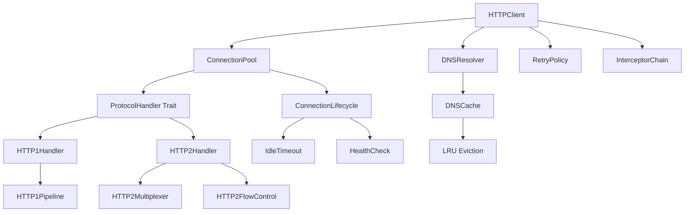
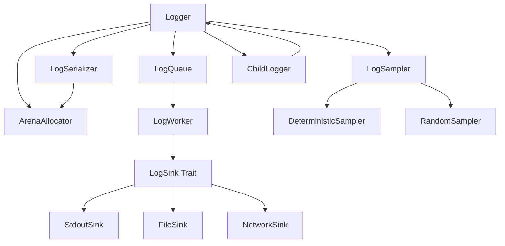

# Design Document: HTTP Client and Logger Enhancement

## Overview

This design enhances the Sweet web framework with production-grade HTTP client and structured logging components implemented in Mojo. The design leverages Mojo's performance features (SIMD, compile-time optimizations, zero-cost abstractions) while maintaining simplicity and composability.

### Key Components

**HTTP Client Stack:**
- **HTTPClient**: High-level API for making HTTP requests (sync and async)
- **ConnectionPool**: Protocol-agnostic connection pooling with lifecycle management
- **ProtocolHandler**: Trait-based abstraction for HTTP/1.1 and HTTP/2
- **HTTP1Handler**: HTTP/1.1 implementation with optional pipelining
- **HTTP2Handler**: HTTP/2 implementation with multiplexing and flow control
- **DNSResolver**: DNS resolution with TTL-based caching
- **RetryPolicy**: Configurable retry logic with exponential backoff
- **Interceptor**: Trait-based middleware for request/response modification

**Logger Stack:**
- **Logger**: High-level structured logging API
- **LogWorker**: Background worker processing log messages asynchronously
- **LogQueue**: Lock-free SPMC queue for log message passing
- **LogSink**: Trait-based abstraction for log destinations
- **LogSerializer**: Zero-allocation JSON serialization using arena allocators
- **LogSampler**: Sampling logic for high-throughput scenarios

### Design Principles

1. **Separation of Concerns**: HTTP client and logger are independent modules with clear boundaries
2. **Protocol Agnostic Pooling**: Connection pool works with both HTTP/1.1 and HTTP/2
3. **Trait-Based Composition**: Use Mojo traits for extensibility (ProtocolHandler, LogSink, Interceptor)
4. **Zero-Cost Abstractions**: Leverage Mojo's compile-time features and SIMD operations
5. **Arena-Based Allocation**: Use Sweet's arena allocators for hot paths
6. **Progressive Enhancement**: Start with HTTP/1.1, add HTTP/2 as optional upgrade


## Architecture

### HTTP Client Architecture



**Key Architectural Decisions:**

1. **Protocol Handler Abstraction**: `ProtocolHandler` trait allows HTTP/1.1 and HTTP/2 to be swapped transparently
2. **Connection Pool Independence**: Pool manages connections without knowing protocol details
3. **Lazy HTTP/2 Upgrade**: Negotiate HTTP/2 via ALPN during TLS handshake, fall back to HTTP/1.1
4. **Request Routing**: Pool selects appropriate handler based on negotiated protocol
5. **Pipelining vs Multiplexing**: HTTP/1.1 uses sequential pipelining, HTTP/2 uses concurrent multiplexing (no conflict)

### Logger Architecture



**Key Architectural Decisions:**

1. **Lock-Free Queue**: SPMC (Single Producer Multiple Consumer) queue for async logging
2. **Arena Allocation**: Per-thread arena for zero-allocation log formatting
3. **Background Worker**: Dedicated thread processes queue and writes to sinks
4. **Trait-Based Sinks**: Easy to add custom destinations (databases, cloud services)
5. **Context Inheritance**: Child loggers share arena and worker with parent


## Components and Interfaces

### HTTP Client Components

#### HTTPClient

```mojo
struct HTTPClient:
    """High-level HTTP client with sync and async APIs."""
    
    var pool: ConnectionPool
    var dns_resolver: DNSResolver
    var retry_policy: RetryPolicy
    var interceptors: List[Interceptor]
    var config: ClientConfig
    
    fn __init__(inout self, config: ClientConfig):
        """Initialize client with configuration."""
        
    fn get(self, url: String) raises -> Response:
        """Synchronous GET request."""
        
    fn post(self, url: String, body: String) raises -> Response:
        """Synchronous POST request."""
        
    async fn get_async(self, url: String) -> Result[Response, Error]:
        """Asynchronous GET request."""
        
    async fn post_async(self, url: String, body: String) -> Result[Response, Error]:
        """Asynchronous POST request."""
        
    fn request(self, req: Request) raises -> Response:
        """Execute arbitrary request synchronously."""
        
    async fn request_async(self, req: Request) -> Result[Response, Error]:
        """Execute arbitrary request asynchronously."""
        
    fn add_interceptor(inout self, interceptor: Interceptor):
        """Register request/response interceptor."""
```

#### ConnectionPool

```mojo
struct ConnectionPool:
    """Protocol-agnostic connection pool with lifecycle management."""
    
    var pools: Dict[HostPort, HostPool]
    var config: PoolConfig
    var metrics: PoolMetrics
    
    fn __init__(inout self, config: PoolConfig):
        """Initialize pool with configuration."""
        
    fn acquire(inout self, host: String, port: Int) raises -> Connection:
        """Acquire connection from pool or create new one."""
        
    fn release(inout self, conn: Connection):
        """Return connection to pool."""
        
    fn remove(inout self, conn: Connection):
        """Remove connection from pool (on error)."""
        
    fn cleanup_idle(inout self):
        """Remove connections idle longer than timeout."""
        
    fn shutdown(inout self):
        """Gracefully close all connections."""
```

#### ProtocolHandler Trait

```mojo
trait ProtocolHandler:
    """Abstraction for HTTP protocol implementations."""
    
    fn send_request(inout self, req: Request) raises -> Response:
        """Send request and receive response."""
        
    fn can_pipeline(self) -> Bool:
        """Whether this protocol supports pipelining/multiplexing."""
        
    fn max_concurrent_requests(self) -> Int:
        """Maximum concurrent requests on this connection."""
        
    fn handle_server_push(inout self, stream_id: Int) raises -> Response:
        """Handle server push (HTTP/2 only)."""
        
    fn close(inout self):
        """Close connection gracefully."""
```

#### HTTP1Handler

```mojo
struct HTTP1Handler(ProtocolHandler):
    """HTTP/1.1 implementation with optional pipelining."""
    
    var connection: TCPConnection
    var pipeline: HTTP1Pipeline
    var config: HTTP1Config
    
    fn __init__(inout self, conn: TCPConnection, config: HTTP1Config):
        """Initialize handler with connection."""
        
    fn send_request(inout self, req: Request) raises -> Response:
        """Send request, optionally pipeline if enabled."""
        
    fn can_pipeline(self) -> Bool:
        """Returns True if pipelining is enabled."""
        
    fn max_concurrent_requests(self) -> Int:
        """Returns pipeline depth or 1 if disabled."""
```

#### HTTP2Handler

```mojo
struct HTTP2Handler(ProtocolHandler):
    """HTTP/2 implementation with multiplexing and flow control."""
    
    var connection: TCPConnection
    var multiplexer: HTTP2Multiplexer
    var flow_control: HTTP2FlowControl
    var config: HTTP2Config
    
    fn __init__(inout self, conn: TCPConnection, config: HTTP2Config):
        """Initialize handler with connection."""
        
    fn send_request(inout self, req: Request) raises -> Response:
        """Send request on new stream."""
        
    fn can_pipeline(self) -> Bool:
        """Returns True (HTTP/2 always supports multiplexing)."""
        
    fn max_concurrent_requests(self) -> Int:
        """Returns SETTINGS_MAX_CONCURRENT_STREAMS."""
        
    fn handle_server_push(inout self, stream_id: Int) raises -> Response:
        """Process server push frame."""
```


#### DNSResolver

```mojo
struct DNSResolver:
    """DNS resolver with TTL-based caching."""
    
    var cache: DNSCache
    var config: DNSConfig
    
    fn __init__(inout self, config: DNSConfig):
        """Initialize resolver with configuration."""
        
    fn resolve(inout self, hostname: String) raises -> List[IPAddress]:
        """Resolve hostname to IP addresses, using cache if available."""
        
    fn resolve_with_timeout(inout self, hostname: String, timeout: Duration) raises -> List[IPAddress]:
        """Resolve with timeout."""
        
    fn invalidate(inout self, hostname: String):
        """Remove hostname from cache."""
```

#### RetryPolicy

```mojo
struct RetryPolicy:
    """Configurable retry logic with exponential backoff."""
    
    var max_attempts: Int
    var base_delay: Duration
    var max_delay: Duration
    var jitter: Bool
    var retryable_status_codes: Set[Int]
    var retry_non_idempotent: Bool
    
    fn should_retry(self, attempt: Int, error: Error, method: HTTPMethod) -> Bool:
        """Determine if request should be retried."""
        
    fn backoff_delay(self, attempt: Int) -> Duration:
        """Calculate backoff delay with optional jitter."""
```

#### Interceptor Trait

```mojo
trait Interceptor:
    """Middleware for request/response modification."""
    
    fn intercept_request(inout self, req: Request) raises -> Request:
        """Modify request before sending."""
        
    fn intercept_response(inout self, res: Response) raises -> Response:
        """Modify response after receiving."""
```

### Logger Components

#### Logger

```mojo
struct Logger:
    """High-performance structured logger."""
    
    var queue: LogQueue
    var worker: LogWorker
    var arena: ArenaAllocator
    var level: LogLevel
    var fields: Dict[String, String]
    var sampler: Optional[LogSampler]
    
    fn __init__(inout self, config: LogConfig):
        """Initialize logger with configuration."""
        
    fn debug(self, message: String, **fields):
        """Log debug message."""
        
    fn info(self, message: String, **fields):
        """Log info message."""
        
    fn warn(self, message: String, **fields):
        """Log warning message."""
        
    fn error(self, message: String, **fields):
        """Log error message."""
        
    fn fatal(self, message: String, **fields):
        """Log fatal message and exit."""
        
    fn child(self, **fields) -> Logger:
        """Create child logger with additional context."""
        
    fn flush(self):
        """Wait for all queued messages to be written."""
        
    fn with_sampler(inout self, sampler: LogSampler):
        """Enable sampling."""
```

#### LogQueue

```mojo
struct LogQueue:
    """Lock-free SPMC queue for log messages."""
    
    var buffer: UnsafePointer[LogEntry]
    var capacity: Int
    var head: Atomic[Int]
    var tail: Atomic[Int]
    var drop_on_full: Bool
    var dropped_count: Atomic[Int]
    
    fn __init__(inout self, capacity: Int, drop_on_full: Bool):
        """Initialize queue with capacity."""
        
    fn enqueue(inout self, entry: LogEntry) -> Bool:
        """Enqueue log entry, returns False if full and dropping."""
        
    fn dequeue(inout self) -> Optional[LogEntry]:
        """Dequeue log entry, returns None if empty."""
```


#### LogWorker

```mojo
struct LogWorker:
    """Background worker processing log messages."""
    
    var queue: LogQueue
    var sinks: List[LogSink]
    var running: Atomic[Bool]
    var thread: Thread
    
    fn __init__(inout self, queue: LogQueue, sinks: List[LogSink]):
        """Initialize worker with queue and sinks."""
        
    fn start(inout self):
        """Start background processing thread."""
        
    fn stop(inout self):
        """Stop background thread gracefully."""
        
    fn run(inout self):
        """Main worker loop (runs in background thread)."""
```

#### LogSink Trait

```mojo
trait LogSink:
    """Abstraction for log destinations."""
    
    fn write(inout self, entry: LogEntry) raises:
        """Write log entry to destination."""
        
    fn flush(inout self) raises:
        """Flush buffered entries."""
        
    fn close(inout self):
        """Close sink and release resources."""
```

#### LogSerializer

```mojo
struct LogSerializer:
    """Zero-allocation JSON serialization using arena."""
    
    var arena: ArenaAllocator
    var custom_serializers: Dict[String, Serializer]
    
    fn __init__(inout self, arena: ArenaAllocator):
        """Initialize serializer with arena."""
        
    fn serialize(inout self, entry: LogEntry) -> String:
        """Serialize log entry to JSON string."""
        
    fn register_serializer(inout self, field: String, serializer: Serializer):
        """Register custom serializer for field."""
```

#### LogSampler

```mojo
struct LogSampler:
    """Sampling logic for high-throughput scenarios."""
    
    var rate: Float64
    var always_log_errors: Bool
    var deterministic: Bool
    
    fn should_sample(self, entry: LogEntry) -> Bool:
        """Determine if entry should be logged."""
```


## Data Models

### HTTP Client Data Models

#### Request

```mojo
struct Request:
    """HTTP request representation."""
    
    var method: HTTPMethod
    var url: URL
    var headers: Headers
    var body: Optional[Body]
    var timeout: Optional[Duration]
    var metadata: Dict[String, String]  # For interceptors
    
    fn __init__(inout self, method: HTTPMethod, url: String):
        """Create request with method and URL."""
        
    fn with_header(inout self, key: String, value: String) -> Self:
        """Add header (builder pattern)."""
        
    fn with_body(inout self, body: String) -> Self:
        """Set request body."""
        
    fn with_timeout(inout self, timeout: Duration) -> Self:
        """Set request timeout."""
```

#### Response

```mojo
struct Response:
    """HTTP response representation."""
    
    var status: Int
    var headers: Headers
    var body: String
    var protocol: Protocol  # HTTP/1.1 or HTTP/2
    var metadata: Dict[String, String]
    
    fn is_success(self) -> Bool:
        """Returns True if status is 2xx."""
        
    fn is_redirect(self) -> Bool:
        """Returns True if status is 3xx."""
        
    fn is_error(self) -> Bool:
        """Returns True if status is 4xx or 5xx."""
```

#### Connection

```mojo
struct Connection:
    """Represents a pooled connection."""
    
    var id: UUID
    var socket: TCPConnection
    var protocol: Protocol
    var handler: ProtocolHandler
    var created_at: Timestamp
    var last_used: Timestamp
    var request_count: Int
    var state: ConnectionState
    
    fn is_idle(self, timeout: Duration) -> Bool:
        """Check if connection has been idle too long."""
        
    fn is_healthy(self) -> Bool:
        """Check if connection is still usable."""
```

#### HostPool

```mojo
struct HostPool:
    """Per-host connection pool."""
    
    var host: String
    var port: Int
    var idle_connections: List[Connection]
    var active_connections: Set[UUID]
    var pending_requests: Queue[PendingRequest]
    var max_connections: Int
    var lock: Mutex
    
    fn acquire(inout self) raises -> Connection:
        """Get idle connection or create new one."""
        
    fn release(inout self, conn: Connection):
        """Return connection to idle pool."""
```


#### DNSCache

```mojo
struct DNSCache:
    """LRU cache for DNS lookups."""
    
    var entries: Dict[String, DNSEntry]
    var lru_list: LinkedList[String]
    var max_size: Int
    var lock: RWLock
    
    fn get(self, hostname: String) -> Optional[DNSEntry]:
        """Get cached entry if not expired."""
        
    fn put(inout self, hostname: String, entry: DNSEntry):
        """Add entry to cache, evict LRU if full."""
```

#### DNSEntry

```mojo
struct DNSEntry:
    """Cached DNS lookup result."""
    
    var hostname: String
    var addresses: List[IPAddress]
    var ttl: Duration
    var cached_at: Timestamp
    var negative: Bool  # True for failed lookups
    
    fn is_expired(self) -> Bool:
        """Check if entry has exceeded TTL."""
```

### Logger Data Models

#### LogEntry

```mojo
struct LogEntry:
    """Represents a single log message."""
    
    var timestamp: Timestamp
    var level: LogLevel
    var message: String
    var fields: Dict[String, String]
    var arena_ptr: UnsafePointer[ArenaAllocator]  # For zero-copy
    
    fn __init__(inout self, level: LogLevel, message: String):
        """Create log entry."""
```

#### LogLevel

```mojo
@value
struct LogLevel:
    """Log severity levels."""
    
    var value: Int
    
    alias Debug = LogLevel(0)
    alias Info = LogLevel(1)
    alias Warn = LogLevel(2)
    alias Error = LogLevel(3)
    alias Fatal = LogLevel(4)
    
    fn __str__(self) -> String:
        """String representation."""
```

#### LogConfig

```mojo
struct LogConfig:
    """Logger configuration."""
    
    var level: LogLevel
    var queue_size: Int
    var drop_on_full: Bool
    var sinks: List[LogSink]
    var enable_sampling: Bool
    var sampling_rate: Float64
    var arena_size: Int
    
    fn default() -> Self:
        """Create default configuration."""
```


## Correctness Properties

*A property is a characteristic or behavior that should hold true across all valid executions of a system—essentially, a formal statement about what the system should do. Properties serve as the bridge between human-readable specifications and machine-verifiable correctness guarantees.*

### HTTP Client Properties

#### Property 1: Connection Pool Isolation

*For any* set of host-port combinations, connections in one pool should never be used for requests to a different host-port combination.

**Validates: Requirements 1.1**

#### Property 2: Connection Reuse

*For any* sequence of requests to the same host, if a connection is released back to the pool and another request is made before the idle timeout, the same connection should be reused.

**Validates: Requirements 1.2**

#### Property 3: Pool Growth Limit

*For any* connection pool with maximum size N, the number of active connections should never exceed N, and requests beyond capacity should be queued.

**Validates: Requirements 1.3, 1.4**

#### Property 4: Idle Connection Cleanup

*For any* connection that has been idle longer than the configured timeout, it should be removed from the pool during the next cleanup cycle.

**Validates: Requirements 1.5**

#### Property 5: Error Connection Removal

*For any* connection that encounters an error during request processing, it should be immediately removed from the pool and not reused.

**Validates: Requirements 1.6**

#### Property 6: Pipeline Request Ordering

*For any* sequence of pipelined requests on an HTTP/1.1 connection, responses should be matched to requests in the exact order the requests were sent (FIFO ordering).

**Validates: Requirements 2.2**

#### Property 7: Pipeline Depth Limit

*For any* HTTP/1.1 connection with pipelining enabled and maximum depth D, no more than D requests should be sent before receiving at least one response.

**Validates: Requirements 2.4**

#### Property 8: Connection Close Handling

*For any* HTTP/1.1 connection that receives a "Connection: close" header, no additional requests should be pipelined on that connection.

**Validates: Requirements 2.5**

#### Property 9: HTTP/2 Stream Limit

*For any* HTTP/2 connection with server SETTINGS_MAX_CONCURRENT_STREAMS = N, the number of concurrent active streams should never exceed N.

**Validates: Requirements 3.3**

#### Property 10: HTTP/2 GOAWAY Handling

*For any* HTTP/2 connection that receives a GOAWAY frame, no new streams should be created on that connection.

**Validates: Requirements 3.6**


#### Property 11: Streaming Chunked Encoding

*For any* HTTP/1.1 streaming request, the request should use chunked transfer encoding (Transfer-Encoding: chunked header present).

**Validates: Requirements 4.3**

#### Property 12: Streaming Incremental Processing

*For any* streaming response, chunks should be processed and delivered to the callback as they arrive, without buffering the entire response body.

**Validates: Requirements 4.4**

#### Property 13: Streaming Backpressure

*For any* streaming request or response, when the consumer cannot keep up with the producer, flow control should pause the stream until the consumer is ready.

**Validates: Requirements 4.5**

#### Property 14: Timeout Enforcement

*For any* request with a configured timeout T, if the operation does not complete within T duration, it should be cancelled and return a timeout error.

**Validates: Requirements 5.1, 5.2, 5.3, 5.4, 5.5**

#### Property 15: DNS Cache Round-Trip

*For any* hostname that is successfully resolved, subsequent lookups within the TTL period should return the cached result without performing a new DNS query.

**Validates: Requirements 6.1, 6.2, 6.3**

#### Property 16: DNS Cache LRU Eviction

*For any* DNS cache with maximum size N, when the cache is full and a new entry is added, the least recently used entry should be evicted.

**Validates: Requirements 6.4, 6.5**

#### Property 17: DNS Negative Caching

*For any* hostname that fails to resolve, the failure should be cached and subsequent lookups within the TTL period should return the cached failure without performing a new DNS query.

**Validates: Requirements 6.6**

#### Property 18: Exponential Backoff

*For any* retry attempt number N, the backoff delay should be approximately base_delay * (2 ^ N), capped at max_delay, with optional jitter.

**Validates: Requirements 7.3, 7.4**

#### Property 19: Idempotent Retry Default

*For any* non-idempotent HTTP method (POST, PATCH), requests should not be retried by default unless explicitly configured to allow retries.

**Validates: Requirements 7.5, 7.6**

#### Property 20: Interceptor Execution Order

*For any* sequence of registered interceptors [I1, I2, ..., In], they should be executed in registration order, and if any interceptor returns an error, subsequent interceptors should not execute.

**Validates: Requirements 8.2, 8.4, 8.7**

#### Property 21: Interceptor Request Modification

*For any* request interceptor that modifies a request field, the modified value should be present in the request sent to the server.

**Validates: Requirements 8.5**

#### Property 22: Shared Connection Pool

*For any* HTTP client instance, both synchronous and asynchronous requests should acquire connections from the same underlying connection pool.

**Validates: Requirements 9.3**


### Logger Properties

#### Property 23: Zero-Allocation Hot Path

*For any* log message written using the logger, no heap allocations should occur in the calling thread (all allocations should use the arena allocator).

**Validates: Requirements 10.1**

#### Property 24: JSON Output Format

*For any* log entry written to a sink, the output should be valid JSON that can be parsed back into a structured object.

**Validates: Requirements 10.2**

#### Property 25: Log Level Filtering

*For any* logger configured with minimum level L, log messages with level below L should not be written to any sink.

**Validates: Requirements 10.4**

#### Property 26: Log Entry Completeness

*For any* log entry, the output should contain timestamp, level, message, and all structured fields provided by the caller.

**Validates: Requirements 10.5**

#### Property 27: Non-Blocking Logging

*For any* log message, the logging call should return immediately without blocking on I/O operations.

**Validates: Requirements 10.6**

#### Property 28: Message Ordering Preservation

*For any* sequence of log messages [M1, M2, ..., Mn] written by a single thread, they should appear in the same order in the output sink.

**Validates: Requirements 11.2**

#### Property 29: Flush Completeness

*For any* logger with queued messages, calling flush() should block until all messages in the queue at the time of the call have been written to all sinks.

**Validates: Requirements 11.3**

#### Property 30: Queue Full Behavior

*For any* logger with a full queue, the behavior should match the configuration: either drop the message and increment dropped count, or block until space is available.

**Validates: Requirements 11.4, 11.5**

#### Property 31: Child Logger Context Inheritance

*For any* child logger created from a parent with fields F, all log messages from the child should include fields F in addition to any child-specific fields.

**Validates: Requirements 12.2**

#### Property 32: Child Logger Isolation

*For any* child logger that adds field X, the parent logger should not include field X in its log messages.

**Validates: Requirements 12.3**

#### Property 33: Child Logger Worker Sharing

*For any* child logger created from a parent, both should enqueue messages to the same queue and use the same background worker.

**Validates: Requirements 12.4**

#### Property 34: Child Logger Level Inheritance

*For any* child logger created without an explicit level, it should filter messages using the parent's log level.

**Validates: Requirements 12.5**


#### Property 35: Custom Serializer Usage

*For any* field with a registered custom serializer, the serialized output should use the custom serializer instead of the default serialization.

**Validates: Requirements 13.2**

#### Property 36: Serializer Chaining

*For any* field with multiple chained serializers [S1, S2, ..., Sn], the output should be the result of applying S1, then S2, ..., then Sn in sequence.

**Validates: Requirements 13.4**

#### Property 37: Multi-Sink Broadcasting

*For any* logger with N registered sinks, each log message should be written to all N sinks.

**Validates: Requirements 14.2**

#### Property 38: Sink Failure Isolation

*For any* logger with multiple sinks where one sink fails, the message should still be written to all other sinks successfully.

**Validates: Requirements 14.4**

#### Property 39: Sink Error Tracking

*For any* sink that encounters a write error, the error count for that specific sink should be incremented.

**Validates: Requirements 14.5**

#### Property 40: Sampling Rate Enforcement

*For any* logger with sampling enabled at rate R (0 < R < 1), approximately R * 100% of Debug, Info, and Warn messages should be logged over a large sample size.

**Validates: Requirements 15.1**

#### Property 41: Error Level Sampling Exemption

*For any* logger with sampling enabled, all messages at Error and Fatal levels should be logged regardless of the sampling rate.

**Validates: Requirements 15.2**

#### Property 42: Sampling Metadata Inclusion

*For any* log message that passes through a sampler, the output should include metadata indicating the sampling rate and whether the message was sampled.

**Validates: Requirements 15.4**


## Error Handling

### HTTP Client Error Handling

#### Connection Errors

- **DNS Resolution Failure**: Return `DNSError` with hostname and reason
- **Connection Timeout**: Return `TimeoutError` with timeout duration
- **Connection Refused**: Return `ConnectionError` with host and port
- **TLS Handshake Failure**: Return `TLSError` with certificate details

**Recovery Strategy**: Retry with backoff if configured, otherwise propagate error to caller.

#### Protocol Errors

- **Invalid HTTP Response**: Return `ProtocolError` with raw response data
- **HTTP/2 Protocol Violation**: Return `HTTP2Error` with frame details
- **Unexpected Connection Close**: Return `ConnectionError` and remove connection from pool

**Recovery Strategy**: Close connection, remove from pool, retry on new connection if configured.

#### Timeout Errors

- **Connection Timeout**: Cancel connection attempt, return `TimeoutError`
- **Request Timeout**: Cancel request, close connection, return `TimeoutError`
- **Idle Timeout**: Close connection, remove from pool

**Recovery Strategy**: Timeouts are not retried by default (user must explicitly configure).

#### Resource Exhaustion

- **Pool Capacity Reached**: Queue request or return `PoolExhaustedError` based on config
- **Too Many Streams (HTTP/2)**: Queue request until stream slot available
- **DNS Cache Full**: Evict LRU entry and continue

**Recovery Strategy**: Queue and wait, or return error immediately based on configuration.

### Logger Error Handling

#### Queue Errors

- **Queue Full (Drop Mode)**: Increment dropped message counter, return immediately
- **Queue Full (Block Mode)**: Block caller until space available
- **Queue Allocation Failure**: Log to stderr, attempt to continue

**Recovery Strategy**: Follow configured behavior (drop or block), never crash.

#### Sink Errors

- **Sink Write Failure**: Increment sink error counter, continue writing to other sinks
- **Sink Unavailable**: Mark sink as failed, attempt reconnection on next write
- **Disk Full (File Sink)**: Log error to stderr, stop writing to that sink

**Recovery Strategy**: Isolate failures to individual sinks, never block or crash.

#### Serialization Errors

- **Custom Serializer Exception**: Fall back to default serialization, log warning
- **Arena Exhausted**: Allocate from heap as fallback, log warning
- **Invalid Field Type**: Serialize as string representation, continue

**Recovery Strategy**: Best-effort serialization, never drop messages due to serialization errors.

#### Worker Thread Errors

- **Worker Thread Crash**: Restart worker thread, log error
- **Unhandled Exception**: Log exception details, continue processing queue
- **Shutdown Timeout**: Force-close sinks after grace period

**Recovery Strategy**: Automatic recovery for worker failures, graceful degradation on shutdown.


## Testing Strategy

### Dual Testing Approach

This feature requires both **unit tests** and **property-based tests** for comprehensive coverage:

- **Unit tests**: Verify specific examples, edge cases, and error conditions
- **Property tests**: Verify universal properties across all inputs through randomization

Both approaches are complementary and necessary. Unit tests catch concrete bugs and verify specific scenarios, while property tests verify general correctness across a wide input space.

### Property-Based Testing Framework

**Framework**: Use Mojo's property-based testing library (or port fast-check/Hypothesis patterns to Mojo)

**Configuration**:
- Minimum 100 iterations per property test (due to randomization)
- Each property test must reference its design document property
- Tag format: `# Feature: http-client-and-logger-enhancement, Property {number}: {property_text}`

**Example Property Test Structure**:

```mojo
@property_test(iterations=100)
fn test_connection_pool_isolation():
    """Property 1: Connection Pool Isolation"""
    # Feature: http-client-and-logger-enhancement, Property 1: Connection Pool Isolation
    
    # Generate random host-port combinations
    let hosts = generate_random_hosts(count=5)
    let pool = ConnectionPool(default_config())
    
    # Create connections for each host
    let connections = Dict[HostPort, Connection]()
    for host in hosts:
        connections[host] = pool.acquire(host.host, host.port)
    
    # Verify connections are isolated per host
    for host in hosts:
        let conn = pool.acquire(host.host, host.port)
        assert conn.id != connections[other_host].id for other_host in hosts if other_host != host
```

### HTTP Client Testing

#### Unit Tests

**Connection Pool Tests**:
- Test pool creation with various configurations
- Test connection reuse with specific sequences
- Test idle timeout with known delays
- Test error handling with simulated failures
- Test graceful shutdown with active connections

**Protocol Handler Tests**:
- Test HTTP/1.1 request/response parsing
- Test HTTP/2 frame encoding/decoding
- Test ALPN negotiation with mock TLS
- Test chunked encoding with specific payloads
- Test flow control with known window sizes

**DNS Resolver Tests**:
- Test cache hit/miss with specific hostnames
- Test TTL expiration with known timestamps
- Test LRU eviction with specific access patterns
- Test negative caching with failed lookups

**Retry Logic Tests**:
- Test exponential backoff calculation with specific attempts
- Test jitter addition with known random seeds
- Test retry limits with specific failure counts
- Test idempotent vs non-idempotent handling

**Interceptor Tests**:
- Test interceptor execution order with specific chains
- Test request modification with known transformations
- Test error propagation with failing interceptors


#### Property-Based Tests

**Property 1-5: Connection Pool**
- Generate random host-port combinations, pool sizes, request sequences
- Verify pool isolation, reuse, growth limits, cleanup, error removal
- Test with concurrent access from multiple threads

**Property 6-10: HTTP Protocol Handling**
- Generate random request sequences, pipeline depths, stream counts
- Verify ordering, limits, connection close handling, GOAWAY handling
- Test with various protocol configurations

**Property 11-13: Streaming**
- Generate random chunk sizes, streaming patterns, backpressure scenarios
- Verify chunked encoding, incremental processing, flow control
- Test with slow consumers and fast producers

**Property 14: Timeouts**
- Generate random timeout values, operation durations
- Verify timeout enforcement across all timeout types
- Test with various delay patterns

**Property 15-17: DNS Caching**
- Generate random hostnames, TTLs, cache sizes
- Verify cache round-trip, LRU eviction, negative caching
- Test with concurrent lookups

**Property 18-19: Retry Logic**
- Generate random failure patterns, retry configurations
- Verify exponential backoff, idempotent handling
- Test with various error types

**Property 20-22: Interceptors**
- Generate random interceptor chains, modifications
- Verify execution order, modifications, pool sharing
- Test with error conditions

#### Integration Tests

**Real Server Tests**:
- Test against real HTTP/1.1 server (nginx or similar)
- Test against real HTTP/2 server (h2o or similar)
- Test TLS handshake with real certificates
- Test redirect following with real redirect chains
- Test compression with real gzip/brotli responses

**Concurrency Tests**:
- Test with 100+ concurrent requests from multiple threads
- Test connection pool under high contention
- Test request cancellation under load
- Measure performance degradation under increasing concurrency

**Memory Profiling**:
- Measure allocations per request (target: zero in hot path)
- Verify no memory leaks over 10,000+ requests
- Measure peak memory usage under load
- Profile arena allocator reuse


### Logger Testing

#### Unit Tests

**Logger Core Tests**:
- Test log level filtering with specific levels
- Test JSON formatting with known fields
- Test arena allocation with specific message sizes
- Test flush behavior with known queue states

**Queue Tests**:
- Test enqueue/dequeue with specific sequences
- Test queue full behavior (drop and block modes)
- Test dropped message counting
- Test queue wraparound with specific capacities

**Worker Tests**:
- Test worker startup and shutdown
- Test message processing with specific sequences
- Test worker recovery from errors
- Test graceful shutdown with pending messages

**Child Logger Tests**:
- Test field inheritance with specific parent fields
- Test field isolation with specific child fields
- Test level inheritance with specific configurations
- Test worker sharing

**Serializer Tests**:
- Test custom serializer registration
- Test serializer chaining with specific transformations
- Test built-in sensitive data serializers
- Test serialization error handling

**Sink Tests**:
- Test stdout sink with specific messages
- Test file sink with specific paths
- Test network sink with mock connections
- Test sink failure isolation
- Test error tracking per sink

**Sampler Tests**:
- Test sampling rate with specific rates
- Test error level exemption
- Test deterministic vs random sampling
- Test metadata inclusion

#### Property-Based Tests

**Property 23: Zero-Allocation Hot Path**
- Generate random log messages, field counts
- Verify no heap allocations in calling thread
- Test with memory profiling enabled

**Property 24: JSON Output Format**
- Generate random log entries with various field types
- Verify output is valid JSON that round-trips correctly
- Test with special characters, unicode, nested structures

**Property 25: Log Level Filtering**
- Generate random log levels, minimum levels
- Verify messages below threshold are filtered
- Test with all level combinations

**Property 26: Log Entry Completeness**
- Generate random messages with various fields
- Verify all fields present in output
- Test with empty fields, null values, special characters

**Property 27: Non-Blocking Logging**
- Generate random log messages
- Verify logging calls return immediately (< 1μs)
- Test with slow sinks

**Property 28: Message Ordering Preservation**
- Generate random message sequences
- Verify output order matches input order
- Test with concurrent logging from single thread

**Property 29: Flush Completeness**
- Generate random queue states
- Verify flush waits for all messages
- Test with various queue sizes

**Property 30: Queue Full Behavior**
- Generate random queue capacities, message rates
- Verify drop/block behavior matches configuration
- Test dropped count accuracy

**Property 31-34: Child Logger**
- Generate random parent/child field combinations
- Verify inheritance, isolation, worker sharing, level inheritance
- Test with nested child loggers

**Property 35-36: Custom Serializers**
- Generate random field types, serializer chains
- Verify custom serializers are used correctly
- Test serializer chaining order

**Property 37-39: Multi-Sink**
- Generate random sink counts, failure patterns
- Verify broadcasting, failure isolation, error tracking
- Test with various sink types

**Property 40-42: Sampling**
- Generate random sampling rates, message counts
- Verify sampling rate accuracy over large samples
- Verify error level exemption, metadata inclusion
- Test deterministic sampling consistency


#### Integration Tests

**Real Sink Tests**:
- Test writing to real files with rotation
- Test writing to network sinks (syslog, logstash)
- Test graceful shutdown and flush with real sinks
- Test sink reconnection after failures

**Concurrency Tests**:
- Test with 100+ threads logging concurrently
- Test queue behavior under high contention
- Test worker throughput under load
- Measure performance degradation under increasing concurrency

**Memory Profiling**:
- Measure allocations per log message (target: zero in hot path)
- Verify arena allocator reuse
- Measure queue memory overhead
- Profile peak memory usage under load

### Performance Benchmarks

#### HTTP Client Benchmarks

**Throughput Benchmarks**:
- Requests per second with connection pooling vs without
- Requests per second HTTP/1.1 vs HTTP/2
- Requests per second with various pool sizes
- Requests per second with pipelining enabled vs disabled

**Latency Benchmarks**:
- Measure p50, p95, p99 latency for single requests
- Measure latency with concurrent requests
- Measure latency with retry enabled
- Measure latency with interceptors

**Memory Benchmarks**:
- Allocations per request (target: minimal)
- Peak memory usage with 1000 concurrent connections
- Memory overhead per pooled connection
- Arena allocator efficiency

#### Logger Benchmarks

**Throughput Benchmarks**:
- Log messages per second (single thread)
- Log messages per second (multi-threaded)
- Throughput with various message sizes
- Throughput with various field counts

**Latency Benchmarks**:
- Caller latency (time to enqueue message)
- End-to-end latency (time until written to sink)
- Latency with queue full (drop vs block mode)
- Latency with multiple sinks

**Memory Benchmarks**:
- Allocations per log message (target: zero in hot path)
- Queue memory overhead
- Arena allocator efficiency
- Peak memory usage under load

### Test Organization

```
tests/
├── http_client/
│   ├── unit/
│   │   ├── test_connection_pool.mojo
│   │   ├── test_http1_handler.mojo
│   │   ├── test_http2_handler.mojo
│   │   ├── test_dns_resolver.mojo
│   │   ├── test_retry_policy.mojo
│   │   └── test_interceptors.mojo
│   ├── property/
│   │   ├── test_pool_properties.mojo
│   │   ├── test_protocol_properties.mojo
│   │   ├── test_streaming_properties.mojo
│   │   ├── test_timeout_properties.mojo
│   │   ├── test_dns_properties.mojo
│   │   └── test_retry_properties.mojo
│   ├── integration/
│   │   ├── test_real_servers.mojo
│   │   ├── test_concurrency.mojo
│   │   └── test_memory_profiling.mojo
│   └── benchmarks/
│       ├── bench_throughput.mojo
│       ├── bench_latency.mojo
│       └── bench_memory.mojo
├── logger/
│   ├── unit/
│   │   ├── test_logger_core.mojo
│   │   ├── test_queue.mojo
│   │   ├── test_worker.mojo
│   │   ├── test_child_logger.mojo
│   │   ├── test_serializers.mojo
│   │   ├── test_sinks.mojo
│   │   └── test_sampler.mojo
│   ├── property/
│   │   ├── test_allocation_properties.mojo
│   │   ├── test_format_properties.mojo
│   │   ├── test_filtering_properties.mojo
│   │   ├── test_ordering_properties.mojo
│   │   ├── test_child_properties.mojo
│   │   ├── test_serializer_properties.mojo
│   │   ├── test_sink_properties.mojo
│   │   └── test_sampling_properties.mojo
│   ├── integration/
│   │   ├── test_real_sinks.mojo
│   │   ├── test_concurrency.mojo
│   │   └── test_memory_profiling.mojo
│   └── benchmarks/
│       ├── bench_throughput.mojo
│       ├── bench_latency.mojo
│       └── bench_memory.mojo
```

